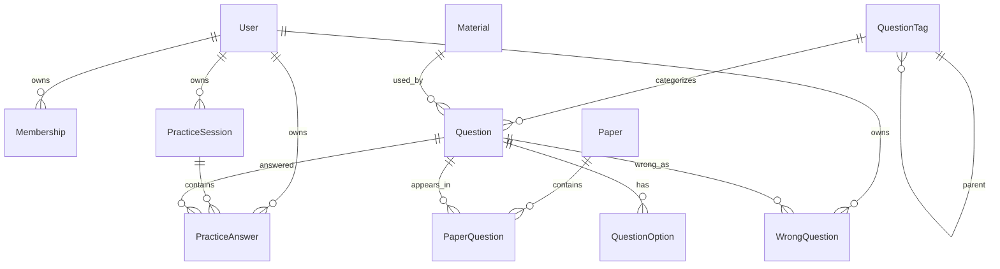

# 公考题库系统数据库设计文档

技术栈：

- Database：MySQL 8+
- ORM：Prisma
- Auth：Auth.js Prisma Adapter

## 1. 设计目标

数据库需要支撑以下核心业务：

- 用户登录与会话。
- 会员权限。
- 题库题目、选项、材料、解析。
- 历年试卷。
- 专项分类。
- 每日一练。
- 用户练习会话。
- 用户答案。
- 错题本。
- 练习统计。
- 后台录题和批量导入。

设计原则：

- 题目结构化存储，避免只存一整段 JSON。
- 题干、解析、材料允许保留富文本 HTML。
- 试卷练习、专项练习、每日一练、错题练习统一沉淀为 `PracticeSession`。
- 用户每次作答统一沉淀为 `PracticeAnswer`。
- 错题本由作答结果派生，同时维护 `WrongQuestion` 方便查询。
- 高频查询字段必须建立索引。
- 题库内容使用软删除，用户练习记录默认保留。

## 2. 核心实体概览



## 3. 枚举设计

### UserRole

```txt
USER
ADMIN
SUPER_ADMIN
```

### QuestionType

```txt
SINGLE
MULTIPLE
JUDGE
```

### Difficulty

```txt
EASY
MEDIUM
HARD
UNKNOWN
```

### PracticeMode

```txt
PAPER
SPECIAL
DAILY
WRONG
MEMORIZE
REVIEW
```

### PracticeStatus

```txt
IN_PROGRESS
SUBMITTED
ABANDONED
```

### MembershipStatus

```txt
ACTIVE
EXPIRED
CANCELLED
```

## 4. Auth.js 基础表

Auth.js Prisma Adapter 需要以下表：

- `User`
- `Account`
- `Session`
- `VerificationToken`

### User

用途：保存用户基础信息、角色和登录资料。

关键字段：

- `id`
- `name`
- `email`
- `emailVerified`
- `image`
- `passwordHash`
- `role`
- `createdAt`
- `updatedAt`

说明：

- 如果只做 OAuth，可不需要 `passwordHash`。
- 如果要支持邮箱密码登录，需要保存哈希后的密码。
- `role` 用于管理后台权限。

### Account / Session / VerificationToken

用途：Auth.js 标准表。

说明：

- 保持 Auth.js 官方结构。
- 不在业务代码里绕过 Auth.js 直接操作 session。

## 5. 会员表

### Membership

用途：记录用户会员状态。

字段：

- `id`
- `userId`
- `status`
- `startedAt`
- `endedAt`
- `source`
- `createdAt`
- `updatedAt`

索引：

- `userId`
- `status`
- `endedAt`

业务规则：

- 判断会员时优先取用户当前 `ACTIVE` 且 `endedAt > now()` 的记录。
- 历史会员记录保留，不覆盖旧记录。

## 6. 专项分类表

### QuestionTag

用途：保存专项练习分类树。

字段：

- `id`
- `name`
- `slug`
- `parentId`
- `sortOrder`
- `isMaterialOnly`
- `isActive`
- `createdAt`
- `updatedAt`

说明：

- `parentId` 支持树结构。
- `isMaterialOnly` 用于标记“资料分析”“篇章阅读”“组合排列（材料）”等不能混练的材料类专项。
- `slug` 用于 URL 和导入去重。

索引：

- `parentId`
- `slug`
- `isActive`

## 7. 材料表

### Material

用途：保存材料题的大段材料。

字段：

- `id`
- `title`
- `contentHtml`
- `plainText`
- `source`
- `createdAt`
- `updatedAt`

说明：

- 多个题目可以共用同一份材料。
- `plainText` 用于搜索和后台预览。

索引：

- `createdAt`

## 8. 题目表

### Question

用途：保存题目主体。

字段：

- `id`
- `type`
- `titleHtml`
- `plainText`
- `analysisHtml`
- `correctAnswer`
- `difficulty`
- `globalAccuracy`
- `source`
- `tagId`
- `materialId`
- `isVipOnly`
- `isActive`
- `createdAt`
- `updatedAt`
- `deletedAt`

说明：

- `correctAnswer` 使用选项 value，例如单选 `0`，多选 `0,2`。
- `globalAccuracy` 可以保存站内或自建统计正确率。
- `plainText` 用于搜索、错题列表预览。
- `deletedAt` 为软删除字段。

索引：

- `tagId`
- `materialId`
- `type`
- `difficulty`
- `isActive`
- `isVipOnly`
- `createdAt`

### QuestionOption

用途：保存选项。

字段：

- `id`
- `questionId`
- `label`
- `value`
- `contentHtml`
- `plainText`
- `sortOrder`

说明：

- 单选、多选使用 A/B/C/D 展示，但判断题也可以用选项建模。
- `value` 对应正确答案中的值。

唯一约束：

- `questionId + value`

索引：

- `questionId`

## 9. 试卷表

### Paper

用途：保存历年试卷。

字段：

- `id`
- `title`
- `slug`
- `year`
- `province`
- `examType`
- `difficultyScore`
- `isVipOnly`
- `isActive`
- `createdAt`
- `updatedAt`
- `deletedAt`

说明：

- `examType` 可保存国考、省考、事业单位等。
- `difficultyScore` 可用于星级评分。

索引：

- `year`
- `province`
- `examType`
- `slug`
- `isActive`

### PaperQuestion

用途：保存试卷与题目的关系。

字段：

- `id`
- `paperId`
- `questionId`
- `sortOrder`
- `sectionName`
- `sectionStart`
- `sectionEnd`
- `score`

说明：

- `sectionName` 用于答题卡分组，例如“常识判断”“资料分析”。
- `sectionStart` 和 `sectionEnd` 可冗余保存分组范围，方便快速展示答题卡。
- `sortOrder` 决定试卷中的题目顺序。

唯一约束：

- `paperId + questionId`
- `paperId + sortOrder`

索引：

- `paperId`
- `questionId`

## 10. 每日一练表

### DailyPractice

用途：配置每日一练。

字段：

- `id`
- `date`
- `title`
- `isActive`
- `createdAt`
- `updatedAt`

唯一约束：

- `date`

### DailyPracticeQuestion

用途：每日一练题目关系。

字段：

- `id`
- `dailyPracticeId`
- `questionId`
- `sortOrder`

唯一约束：

- `dailyPracticeId + questionId`
- `dailyPracticeId + sortOrder`

## 11. 练习会话表

### PracticeSession

用途：保存一次练习。

字段：

- `id`
- `userId`
- `mode`
- `status`
- `title`
- `paperId`
- `sourceTagIdsJson`
- `difficulty`
- `totalCount`
- `answeredCount`
- `correctCount`
- `wrongCount`
- `unansweredCount`
- `elapsedSeconds`
- `accuracy`
- `submittedAt`
- `createdAt`
- `updatedAt`

说明：

- 历年试卷、专项练习、每日一练、错题练习都创建一条 `PracticeSession`。
- `sourceTagIdsJson` 保存专项练习来源知识点。
- `status` 标记进行中、已提交、已放弃。
- `accuracy` 保存提交时正确率快照。

索引：

- `userId`
- `mode`
- `status`
- `paperId`
- `createdAt`
- `submittedAt`

## 12. 用户答案表

### PracticeAnswer

用途：保存用户在某次练习中的单题作答。

字段：

- `id`
- `sessionId`
- `userId`
- `questionId`
- `answer`
- `isCorrect`
- `timeSpentSeconds`
- `sortOrder`
- `answeredAt`
- `createdAt`
- `updatedAt`

说明：

- `answer` 保存用户答案，例如 `0` 或 `0,2`。
- 未答题可以不写记录，也可以写 `answer = null`；建议提交时为每题写一条，方便统计未答。
- `sortOrder` 保存本次练习内的题号。

唯一约束：

- `sessionId + questionId`

索引：

- `sessionId`
- `userId`
- `questionId`
- `isCorrect`
- `createdAt`

## 13. 错题表

### WrongQuestion

用途：维护用户当前错题本。

字段：

- `id`
- `userId`
- `questionId`
- `tagId`
- `wrongCount`
- `lastWrongAt`
- `lastPracticeAnswerId`
- `resolvedAt`
- `createdAt`
- `updatedAt`

说明：

- 用户答错后 upsert。
- 再次答错增加 `wrongCount`。
- 用户在错题练习中答对后，可设置 `resolvedAt`。
- 也可以保留历史错题，只在查询时过滤已解决。

唯一约束：

- `userId + questionId`

索引：

- `userId`
- `tagId`
- `resolvedAt`
- `lastWrongAt`

## 14. 统计表

### UserStatsSnapshot

用途：保存用户统计快照，避免每次打开统计页都全量聚合。

字段：

- `id`
- `userId`
- `totalSessions`
- `totalQuestions`
- `totalCorrect`
- `totalWrong`
- `totalElapsedSeconds`
- `accuracy`
- `snapshotAt`

索引：

- `userId`
- `snapshotAt`

### UserTagStats

用途：保存用户按知识点维度的统计。

字段：

- `id`
- `userId`
- `tagId`
- `answeredCount`
- `correctCount`
- `wrongCount`
- `accuracy`
- `lastPracticedAt`
- `updatedAt`

唯一约束：

- `userId + tagId`

索引：

- `userId`
- `tagId`
- `accuracy`
- `lastPracticedAt`

## 15. 导入与审计表

### ImportJob

用途：记录批量导入任务。

字段：

- `id`
- `userId`
- `type`
- `filename`
- `status`
- `totalRows`
- `successRows`
- `failedRows`
- `errorJson`
- `createdAt`
- `updatedAt`

用途：

- 后台批量导入题目、试卷、分类。
- 失败时可追踪错误。

## 16. 关键索引汇总

题库查询：

- `Question.tagId`
- `Question.difficulty`
- `Question.isActive`
- `Question.isVipOnly`
- `Paper.year`
- `Paper.province`
- `Paper.examType`
- `PaperQuestion.paperId + sortOrder`

练习查询：

- `PracticeSession.userId + createdAt`
- `PracticeSession.userId + mode`
- `PracticeAnswer.sessionId`
- `PracticeAnswer.userId + questionId`

错题查询：

- `WrongQuestion.userId + tagId`
- `WrongQuestion.userId + resolvedAt`
- `WrongQuestion.userId + lastWrongAt`

统计查询：

- `UserTagStats.userId + tagId`
- `UserStatsSnapshot.userId + snapshotAt`

## 17. 删除与归档策略

题库内容：

- 题目、试卷、分类默认软删除。
- 删除题目时不物理删除历史作答记录。
- 已被练习记录引用的题目不可硬删除。

用户数据：

- 练习记录默认长期保留。
- 用户可删除自己的练习记录，但建议标记删除而非物理删除。
- 错题可标记已掌握，不建议直接删除。

导入任务：

- 保留最近 90 天详细错误。
- 长期只保留摘要。

## 18. Prisma Schema 草案

以下 schema 是第一版落地草案，后续可按实际开发继续细化。

```prisma
generator client {
  provider = "prisma-client-js"
}

datasource db {
  provider = "mysql"
  url      = env("DATABASE_URL")
}

enum UserRole {
  USER
  ADMIN
  SUPER_ADMIN
}

enum QuestionType {
  SINGLE
  MULTIPLE
  JUDGE
}

enum Difficulty {
  EASY
  MEDIUM
  HARD
  UNKNOWN
}

enum PracticeMode {
  PAPER
  SPECIAL
  DAILY
  WRONG
  MEMORIZE
  REVIEW
}

enum PracticeStatus {
  IN_PROGRESS
  SUBMITTED
  ABANDONED
}

enum MembershipStatus {
  ACTIVE
  EXPIRED
  CANCELLED
}

model User {
  id            String    @id @default(cuid())
  name          String?
  email         String?   @unique
  emailVerified DateTime?
  image         String?
  passwordHash  String?
  role          UserRole  @default(USER)
  createdAt     DateTime  @default(now())
  updatedAt     DateTime  @updatedAt

  accounts          Account[]
  sessions          Session[]
  memberships       Membership[]
  practiceSessions  PracticeSession[]
  practiceAnswers   PracticeAnswer[]
  wrongQuestions    WrongQuestion[]
  statsSnapshots    UserStatsSnapshot[]
  tagStats          UserTagStats[]
  importJobs        ImportJob[]
}

model Account {
  id                String  @id @default(cuid())
  userId            String
  type              String
  provider          String
  providerAccountId String
  refresh_token     String? @db.Text
  access_token      String? @db.Text
  expires_at        Int?
  token_type        String?
  scope             String?
  id_token          String? @db.Text
  session_state     String?

  user User @relation(fields: [userId], references: [id], onDelete: Cascade)

  @@unique([provider, providerAccountId])
  @@index([userId])
}

model Session {
  id           String   @id @default(cuid())
  sessionToken String   @unique
  userId       String
  expires      DateTime

  user User @relation(fields: [userId], references: [id], onDelete: Cascade)

  @@index([userId])
}

model VerificationToken {
  identifier String
  token      String   @unique
  expires    DateTime

  @@unique([identifier, token])
}

model Membership {
  id        String           @id @default(cuid())
  userId    String
  status    MembershipStatus @default(ACTIVE)
  startedAt DateTime
  endedAt   DateTime
  source    String?
  createdAt DateTime         @default(now())
  updatedAt DateTime         @updatedAt

  user User @relation(fields: [userId], references: [id], onDelete: Cascade)

  @@index([userId])
  @@index([status])
  @@index([endedAt])
}

model QuestionTag {
  id             String   @id @default(cuid())
  name           String
  slug           String   @unique
  parentId       String?
  sortOrder      Int      @default(0)
  isMaterialOnly Boolean  @default(false)
  isActive       Boolean  @default(true)
  createdAt      DateTime @default(now())
  updatedAt      DateTime @updatedAt

  parent    QuestionTag?  @relation("QuestionTagTree", fields: [parentId], references: [id])
  children  QuestionTag[] @relation("QuestionTagTree")
  questions Question[]
  wrongQuestions WrongQuestion[]
  tagStats UserTagStats[]

  @@index([parentId])
  @@index([isActive])
}

model Material {
  id          String   @id @default(cuid())
  title       String?
  contentHtml String   @db.LongText
  plainText   String?  @db.Text
  source      String?
  createdAt   DateTime @default(now())
  updatedAt   DateTime @updatedAt

  questions Question[]
}

model Question {
  id             String       @id @default(cuid())
  type           QuestionType
  titleHtml      String       @db.LongText
  plainText      String?      @db.Text
  analysisHtml   String?      @db.LongText
  correctAnswer  String
  difficulty     Difficulty   @default(UNKNOWN)
  globalAccuracy Decimal?     @db.Decimal(5, 2)
  source         String?
  tagId          String?
  materialId     String?
  isVipOnly      Boolean      @default(false)
  isActive       Boolean      @default(true)
  createdAt      DateTime     @default(now())
  updatedAt      DateTime     @updatedAt
  deletedAt      DateTime?

  tag             QuestionTag?      @relation(fields: [tagId], references: [id])
  material        Material?         @relation(fields: [materialId], references: [id])
  options         QuestionOption[]
  paperQuestions  PaperQuestion[]
  practiceAnswers PracticeAnswer[]
  wrongQuestions  WrongQuestion[]
  dailyQuestions  DailyPracticeQuestion[]

  @@index([tagId])
  @@index([materialId])
  @@index([type])
  @@index([difficulty])
  @@index([isActive])
  @@index([isVipOnly])
  @@index([createdAt])
}

model QuestionOption {
  id          String  @id @default(cuid())
  questionId  String
  label       String
  value       String
  contentHtml String  @db.LongText
  plainText   String? @db.Text
  sortOrder   Int     @default(0)

  question Question @relation(fields: [questionId], references: [id], onDelete: Cascade)

  @@unique([questionId, value])
  @@index([questionId])
}

model Paper {
  id              String    @id @default(cuid())
  title           String
  slug            String    @unique
  year            Int?
  province        String?
  examType        String?
  difficultyScore Decimal?  @db.Decimal(3, 1)
  isVipOnly       Boolean   @default(false)
  isActive        Boolean   @default(true)
  createdAt       DateTime  @default(now())
  updatedAt       DateTime  @updatedAt
  deletedAt       DateTime?

  questions PaperQuestion[]
  sessions  PracticeSession[]

  @@index([year])
  @@index([province])
  @@index([examType])
  @@index([isActive])
}

model PaperQuestion {
  id           String   @id @default(cuid())
  paperId      String
  questionId   String
  sortOrder    Int
  sectionName  String?
  sectionStart Int?
  sectionEnd   Int?
  score        Decimal? @db.Decimal(5, 2)

  paper    Paper    @relation(fields: [paperId], references: [id], onDelete: Cascade)
  question Question @relation(fields: [questionId], references: [id])

  @@unique([paperId, questionId])
  @@unique([paperId, sortOrder])
  @@index([paperId])
  @@index([questionId])
}

model DailyPractice {
  id        String   @id @default(cuid())
  date      DateTime @unique
  title     String
  isActive  Boolean  @default(true)
  createdAt DateTime @default(now())
  updatedAt DateTime @updatedAt

  questions DailyPracticeQuestion[]
}

model DailyPracticeQuestion {
  id              String @id @default(cuid())
  dailyPracticeId String
  questionId      String
  sortOrder       Int

  dailyPractice DailyPractice @relation(fields: [dailyPracticeId], references: [id], onDelete: Cascade)
  question      Question      @relation(fields: [questionId], references: [id])

  @@unique([dailyPracticeId, questionId])
  @@unique([dailyPracticeId, sortOrder])
  @@index([questionId])
}

model PracticeSession {
  id              String         @id @default(cuid())
  userId          String
  mode            PracticeMode
  status          PracticeStatus @default(IN_PROGRESS)
  title           String
  paperId         String?
  sourceTagIdsJson Json?
  difficulty      Difficulty?
  totalCount      Int            @default(0)
  answeredCount   Int            @default(0)
  correctCount    Int            @default(0)
  wrongCount      Int            @default(0)
  unansweredCount Int            @default(0)
  elapsedSeconds  Int            @default(0)
  accuracy        Decimal?       @db.Decimal(5, 2)
  submittedAt     DateTime?
  createdAt       DateTime       @default(now())
  updatedAt       DateTime       @updatedAt

  user    User             @relation(fields: [userId], references: [id], onDelete: Cascade)
  paper   Paper?           @relation(fields: [paperId], references: [id])
  answers PracticeAnswer[]

  @@index([userId])
  @@index([mode])
  @@index([status])
  @@index([paperId])
  @@index([createdAt])
  @@index([submittedAt])
}

model PracticeAnswer {
  id               String   @id @default(cuid())
  sessionId        String
  userId           String
  questionId       String
  answer           String?
  isCorrect        Boolean?
  timeSpentSeconds Int      @default(0)
  sortOrder        Int
  answeredAt       DateTime?
  createdAt        DateTime @default(now())
  updatedAt        DateTime @updatedAt

  session PracticeSession @relation(fields: [sessionId], references: [id], onDelete: Cascade)
  user    User            @relation(fields: [userId], references: [id], onDelete: Cascade)
  question Question       @relation(fields: [questionId], references: [id])
  wrongSources WrongQuestion[] @relation("WrongQuestionLastAnswer")

  @@unique([sessionId, questionId])
  @@index([sessionId])
  @@index([userId])
  @@index([questionId])
  @@index([isCorrect])
  @@index([createdAt])
}

model WrongQuestion {
  id                   String    @id @default(cuid())
  userId               String
  questionId           String
  tagId                String?
  wrongCount           Int       @default(1)
  lastWrongAt          DateTime  @default(now())
  lastPracticeAnswerId String?
  resolvedAt           DateTime?
  createdAt            DateTime  @default(now())
  updatedAt            DateTime  @updatedAt

  user       User            @relation(fields: [userId], references: [id], onDelete: Cascade)
  question   Question        @relation(fields: [questionId], references: [id])
  tag        QuestionTag?    @relation(fields: [tagId], references: [id])
  lastAnswer PracticeAnswer? @relation("WrongQuestionLastAnswer", fields: [lastPracticeAnswerId], references: [id])

  @@unique([userId, questionId])
  @@index([userId])
  @@index([tagId])
  @@index([resolvedAt])
  @@index([lastWrongAt])
}

model UserStatsSnapshot {
  id                  String   @id @default(cuid())
  userId              String
  totalSessions       Int      @default(0)
  totalQuestions      Int      @default(0)
  totalCorrect        Int      @default(0)
  totalWrong          Int      @default(0)
  totalElapsedSeconds Int      @default(0)
  accuracy            Decimal? @db.Decimal(5, 2)
  snapshotAt          DateTime @default(now())

  user User @relation(fields: [userId], references: [id], onDelete: Cascade)

  @@index([userId])
  @@index([snapshotAt])
}

model UserTagStats {
  id              String   @id @default(cuid())
  userId          String
  tagId           String
  answeredCount   Int      @default(0)
  correctCount    Int      @default(0)
  wrongCount      Int      @default(0)
  accuracy        Decimal? @db.Decimal(5, 2)
  lastPracticedAt DateTime?
  updatedAt       DateTime @updatedAt

  user User        @relation(fields: [userId], references: [id], onDelete: Cascade)
  tag  QuestionTag @relation(fields: [tagId], references: [id])

  @@unique([userId, tagId])
  @@index([userId])
  @@index([tagId])
  @@index([accuracy])
  @@index([lastPracticedAt])
}

model ImportJob {
  id          String   @id @default(cuid())
  userId      String
  type        String
  filename    String
  status      String
  totalRows   Int      @default(0)
  successRows Int      @default(0)
  failedRows  Int      @default(0)
  errorJson   Json?
  createdAt   DateTime @default(now())
  updatedAt   DateTime @updatedAt

  user User @relation(fields: [userId], references: [id], onDelete: Cascade)

  @@index([userId])
  @@index([status])
  @@index([createdAt])
}
```

## 19. 后续待确认

开发前需要再确认：

- 是否支持邮箱密码登录，还是只支持 OAuth。
- 题目是否允许多个 tag；第一版暂定一个主 tag。
- 会员权限是否只影响题库，还是同时影响知识库文章。
- 是否需要收藏题目；如果需要，可新增 `FavoriteQuestion`。
- 是否需要题目评论/笔记；如果需要，可新增 `QuestionNote`。
- 是否需要全文搜索；第一版可用 MySQL，后期接 Meilisearch。
