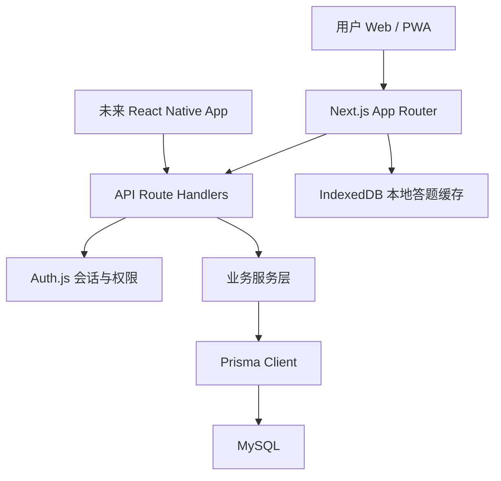
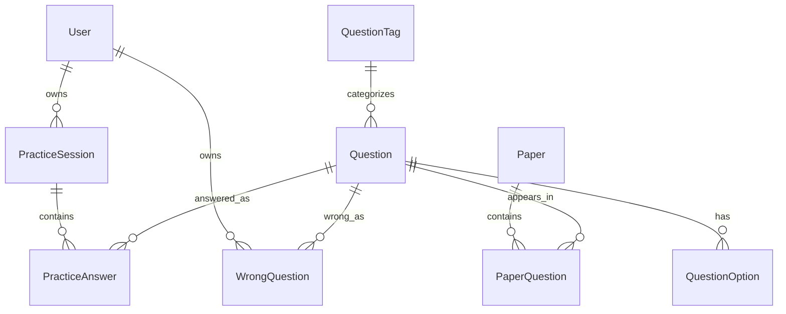
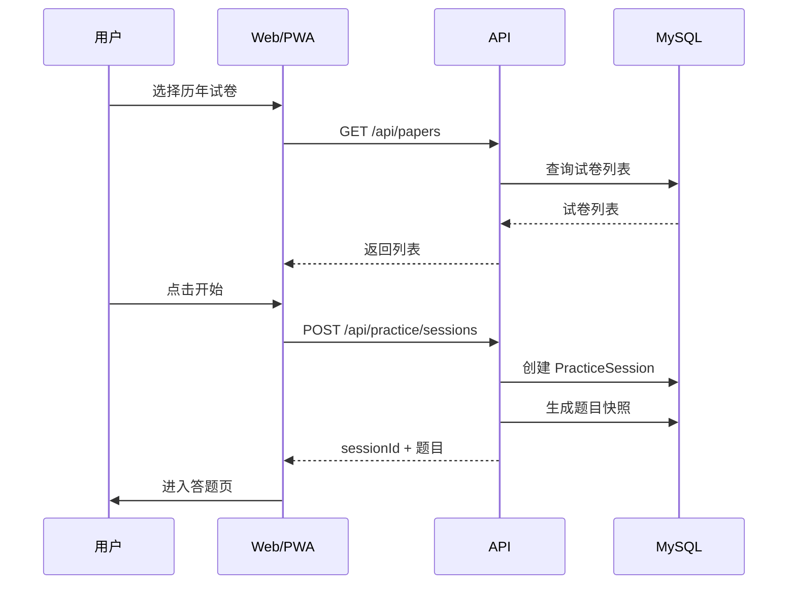
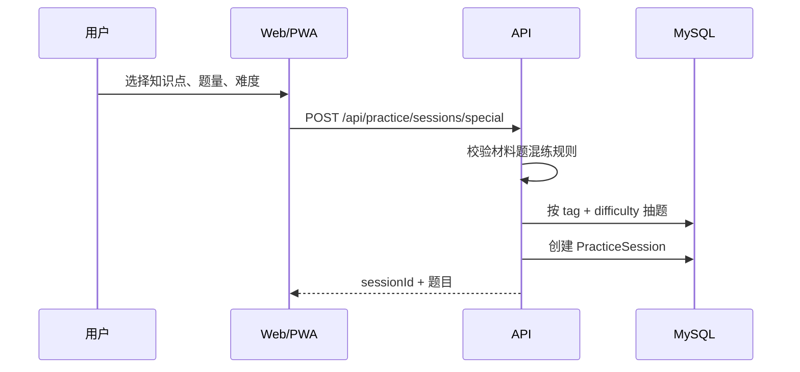
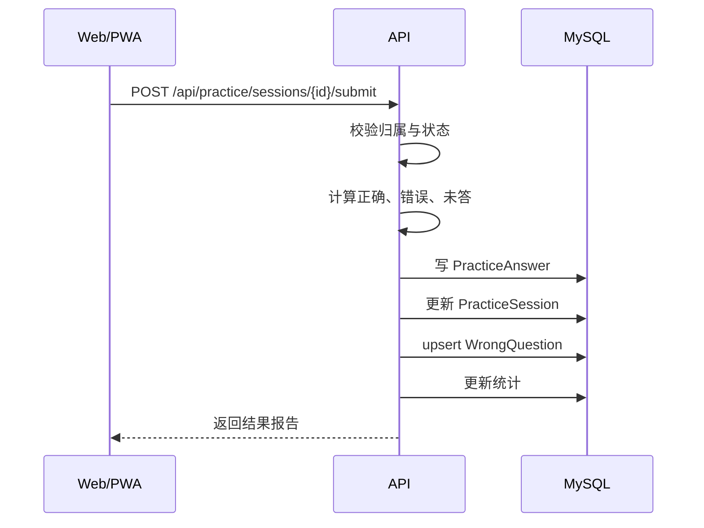
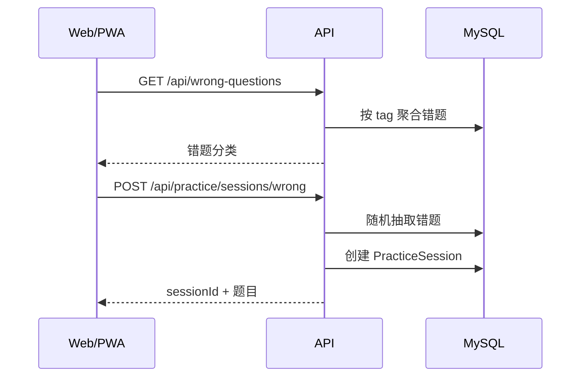

# 公考题库系统技术架构文档

## 1. 架构目标

本项目目标是实现一个面向移动端优先的公考刷题系统，第一阶段使用 Web/PWA 形态交付，后期可平滑扩展到 React Native App。

核心技术栈：

- Next.js：Web 应用、服务端渲染、API Route Handler。
- MySQL：关系型业务数据存储。
- Prisma：数据库建模、迁移、类型安全查询。
- Auth.js：认证、会话、账号体系。
- Tailwind CSS：响应式样式。
- shadcn/ui：基础 UI 组件。
- TanStack Query：客户端请求、缓存、重试、失效刷新。
- Zod：接口入参和业务 DTO 校验。
- IndexedDB/Dexie：移动端本地答题缓存。

后期移动端：

- React Native 或 Expo。
- 复用后端 API、认证模型、业务 DTO、题库数据结构。
- 不复用 Next.js 页面，但复用业务协议和部分 TypeScript 类型。

## 2. 总体架构

系统采用“前端应用 + Next.js API + Prisma 数据层 + MySQL”的单体优先架构。



架构原则：

- 第一阶段保持单体，降低开发和部署复杂度。
- 业务逻辑集中在服务层，不直接写进页面组件。
- 所有移动端未来会用到的能力，都通过 `/api/*` 暴露。
- Server Actions 仅用于 Web 内部简单表单，不作为核心业务接口。
- 数据模型以题库、练习、错题、统计为中心设计。

## 3. 前端架构

### 3.1 Next.js App Router 目录建议

```txt
app/
  (marketing)/
  (auth)/
    login/
    register/
  (app)/
    dashboard/
    question-bank/
      papers/
      special/
      records/
      wrong/
    practice/
      [sessionId]/
  api/
    auth/[...nextauth]/
    papers/
    tags/
    practice/
    records/
    wrong-questions/
components/
  question/
  practice/
  layout/
  ui/
features/
  auth/
  papers/
  tags/
  practice/
  records/
  wrong-questions/
lib/
  auth.ts
  prisma.ts
  validators/
  api-client/
  offline/
prisma/
  schema.prisma
```

### 3.2 页面分层

页面层：

- 负责路由、布局、首屏数据、SEO/PWA metadata。
- 不写复杂业务逻辑。

Feature 层：

- `features/papers`：历年试卷。
- `features/tags`：专项分类树。
- `features/practice`：答题页、答题状态机。
- `features/records`：练习记录。
- `features/wrong-questions`：错题本。

组件层：

- `QuestionStem`：题干和材料。
- `QuestionOptions`：选项。
- `AnswerSheet`：答题卡。
- `PracticeTimer`：计时器。
- `DraftCanvas`：草稿纸。
- `ResultPanel`：提交结果。
- `AnalysisPanel`：答案与解析。

### 3.3 移动端布局原则

移动端优先：

- 题目内容纵向排列。
- 材料题支持折叠或顶部 sticky 区域。
- 答题卡使用底部抽屉。
- 提交、暂停、返回放在底部操作栏。
- 选项按钮高度适合触控。
- 草稿纸全屏浮层或题目区域浮层。
- 使用 `env(safe-area-inset-bottom)` 适配 iOS 底部安全区。

桌面端增强：

- 左侧题目区。
- 右侧答题卡。
- 材料题可分栏展示。
- 统计面板固定在侧边。

## 4. 后端架构

### 4.1 API 优先

考虑未来 React Native，核心业务全部使用 Route Handlers 暴露为 JSON API。

推荐接口前缀：

```txt
/api/auth/*
/api/papers/*
/api/tags/*
/api/practice/*
/api/records/*
/api/wrong-questions/*
/api/stats/*
```

Server Actions 使用边界：

- 可用于 Web 端登录表单、个人资料修改等轻量 Web-only 表单。
- 不用于题库核心流程。
- 不用于未来移动端需要复用的能力。

### 4.2 服务层

建议服务层按领域拆分：

```txt
server/
  services/
    paper-service.ts
    tag-service.ts
    practice-service.ts
    record-service.ts
    wrong-question-service.ts
    stats-service.ts
  repositories/
    paper-repository.ts
    question-repository.ts
    record-repository.ts
  policies/
    auth-policy.ts
    membership-policy.ts
```

职责：

- Route Handler：解析请求、鉴权、调用服务、返回 JSON。
- Service：业务规则、事务、状态流转。
- Repository：Prisma 查询封装。
- Policy：权限、会员、资源归属校验。

## 5. 认证与权限

认证方案：

- Auth.js + Prisma Adapter。
- 第一阶段支持邮箱密码或第三方 OAuth。
- 会话策略优先使用数据库会话，方便服务端校验和主动失效。

核心表：

- `User`
- `Account`
- `Session`
- `VerificationToken`

业务权限：

- 未登录：只能访问公开页面。
- 已登录：可刷题、提交记录、查看个人记录。
- 会员：可访问会员题库、会员知识页或高级统计。
- 管理员：可录题、改题、导入试卷、管理分类。

API 权限规则：

- 所有写入接口必须登录。
- 练习记录、错题、统计必须校验 `userId`。
- 管理后台接口必须校验角色。
- 会员资源通过 `MembershipPolicy` 判断。

## 6. 数据库设计概览

核心实体：

- 用户：`User`
- 会员：`Membership`
- 题目：`Question`
- 选项：`QuestionOption`
- 材料：`Material`
- 试卷：`Paper`
- 试卷题目关系：`PaperQuestion`
- 专项分类：`QuestionTag`
- 练习会话：`PracticeSession`
- 用户作答：`PracticeAnswer`
- 错题：`WrongQuestion`
- 统计快照：`UserStatsSnapshot`

关系概览：



设计取舍：

- 题目和选项结构化存储，避免只保存 HTML 字符串。
- 题干、解析、材料允许保留 HTML 富文本。
- 试卷和专项练习都生成 `PracticeSession`，统一沉淀记录。
- 错题从 `PracticeAnswer` 派生，同时维护一张当前错题表，方便查询。

## 7. 核心业务流程

### 7.1 历年试卷练习



### 7.2 专项练习



### 7.3 提交练习



### 7.4 错题练习



## 8. 答题状态设计

前端答题状态：

```ts
type PracticeMode = "exam" | "practice" | "review" | "memorize";

type PracticeScratchDraft = {
  dataUrl: string;
  mimeType: string;
  width: number;
  height: number;
  updatedAt: string;
};

type PracticeRuntimeState = {
  sessionId: string;
  mode: PracticeMode;
  currentIndex: number;
  elapsedSeconds: number;
  answers: Record<string, UserAnswer>;
  questionTimeSpent: Record<string, number>;
  scratchByQuestionId: Record<string, PracticeScratchDraft>;
  submitted: boolean;
  draftEnabled: boolean;
};
```

状态保存策略：

- 服务端保存已创建的练习会话。
- 前端 IndexedDB 保存进行中的答题进度和按题草稿纸。
- 用户提交时以服务端为准。
- 断网或刷新后优先恢复本地未提交状态。

为什么用 IndexedDB：

- 题目、材料、解析可能较大。
- 移动端刷新和后台切换频繁。
- 比 `localStorage` 更适合结构化、大容量、异步读写。

## 9. API 设计概览

题库：

- `GET /api/papers`
- `GET /api/papers/{paperId}`
- `GET /api/tags`
- `GET /api/questions/{questionId}`

练习：

- `POST /api/practice/sessions`
- `POST /api/practice/sessions/special`
- `POST /api/practice/sessions/daily`
- `POST /api/practice/sessions/wrong`
- `GET /api/practice/sessions/{sessionId}`
- `PATCH /api/practice/sessions/{sessionId}/progress`
- `POST /api/practice/sessions/{sessionId}/submit`

记录与统计：

- `GET /api/records`
- `GET /api/records/{recordId}`
- `GET /api/stats/overview`
- `GET /api/stats/tags`

错题：

- `GET /api/wrong-questions`
- `DELETE /api/wrong-questions/{id}`
- `POST /api/wrong-questions/{id}/resolve`

管理后台：

- `POST /api/admin/questions`
- `PATCH /api/admin/questions/{id}`
- `POST /api/admin/papers`
- `POST /api/admin/import`

响应规范：

```json
{
  "ok": true,
  "data": {},
  "error": null
}
```

错误响应：

```json
{
  "ok": false,
  "data": null,
  "error": {
    "code": "UNAUTHORIZED",
    "message": "请先登录"
  }
}
```

## 10. PWA 与移动端策略

第一阶段先做移动端 Web + PWA：

- 配置 `manifest`.
- 配置应用图标、主题色、启动名称。
- 允许添加到手机桌面。
- 答题页支持弱网下的本地状态保存。

建议缓存策略：

- 静态资源由 Next.js 默认优化。
- 当前练习题目快照进入 IndexedDB。
- 不缓存敏感用户接口响应到 Service Worker。
- 提交失败时保留本地提交草稿，提示用户重试。

后期 React Native：

- 继续复用 `/api/*`。
- 移动端重新实现页面和交互。
- 共享 Zod schema、DTO 类型、业务枚举。
- 使用同一套 Auth 会话或移动端 token 机制。

## 11. 性能设计

数据库：

- 高频查询字段加索引：
  - `Question.tagId`
  - `Question.difficulty`
  - `PaperQuestion.paperId`
  - `PracticeSession.userId`
  - `PracticeSession.createdAt`
  - `WrongQuestion.userId`
  - `WrongQuestion.tagId`
- 大字段如题干、解析、材料避免无意义频繁查询。
- 试卷列表与专项树可做短期缓存。

前端：

- 答题页避免一次性渲染所有题目，只渲染当前题。
- 答题卡可虚拟化或分组渲染。
- 材料 HTML 做安全处理后展示。
- 统计页按需加载。

后端：

- 抽题逻辑在服务层封装。
- 提交练习使用事务。
- 统计可以先同步计算，后期再改为异步任务。

## 12. 安全设计

输入校验：

- 所有 API 入参使用 Zod 校验。
- 题目富文本进入数据库前做清洗。
- 前端渲染 HTML 前做白名单处理。

权限校验：

- 用户只能访问自己的练习记录和错题。
- 管理接口必须校验管理员角色。
- 会员资源必须校验会员状态。

防刷与滥用：

- 登录、提交、导入接口加限流。
- 后期可接 Redis 做 rate limit。
- 管理后台上传导入文件限制大小和格式。

敏感数据：

- 不在客户端暴露数据库 ID 以外的敏感内部字段。
- 不把完整会话对象写入前端日志。
- 生产环境关闭详细错误堆栈。

## 13. 部署架构

开发环境：

- Next.js dev server。
- 本地 MySQL。
- Prisma migrate。

生产环境可选：

- 应用：Vercel、Railway、Render、Docker VPS。
- 数据库：PlanetScale、阿里云 RDS、腾讯云 MySQL、Railway MySQL。
- 文件存储：后期可接 S3/R2/OSS。
- 监控：Sentry。

部署注意：

- 使用 MySQL 时要关注连接池。
- Serverless 部署需要控制 Prisma 连接数量。
- 大量导入题库建议走后台任务，不在请求中长时间阻塞。

## 14. MVP 开发阶段

### Phase 1：核心刷题

- Auth.js 登录。
- 题库基础数据模型。
- 历年试卷列表。
- 试卷答题页。
- 提交练习。
- 结果报告。
- 练习记录列表。

### Phase 2：专项与移动体验

- 专项分类树。
- 专项组题。
- 难度筛选。
- 每日一练。
- IndexedDB 本地恢复。
- PWA manifest。
- 移动端答题卡底部抽屉。

### Phase 3：错题和统计

- 错题本。
- 错题练习。
- 背题模式。
- 模块正确率。
- 知识点统计。
- 草稿纸。

### Phase 4：管理后台

- 题目录入。
- 试卷管理。
- 分类管理。
- 批量导入。
- 富文本图片处理。

### Phase 5：React Native

- 复用 API。
- 复用 DTO/schema。
- 实现原生移动端答题页。
- 支持离线答题缓存。
- 支持推送和移动端专属体验。

## 15. 技术取舍

保留：

- Next.js + MySQL + Prisma + Auth.js 作为主干。
- Route Handlers 作为核心业务 API。
- Web/PWA 作为第一交付形态。
- React Native 作为后期独立客户端。

暂不引入：

- 微服务。
- 独立 BFF。
- MQ。
- Redis 强依赖。
- 搜索引擎。
- 原生 App 首发。

后期可引入：

- Redis：限流、缓存、排行榜。
- Meilisearch/Typesense：题目全文搜索。
- 对象存储：图片、导入文件。
- 后台任务队列：批量导入、统计重算。

## 16. 参考资料

- Next.js App Router：https://nextjs.org/docs/app
- Next.js PWA Guide：https://nextjs.org/docs/app/guides/progressive-web-apps
- Prisma MySQL Connector：https://docs.prisma.io/docs/v6/orm/overview/databases/mysql
- Prisma + Auth.js + Next.js：https://www.prisma.io/docs/guides/authentication/authjs/nextjs
- React Native Architecture：https://reactnative.dev/architecture/overview
