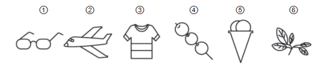
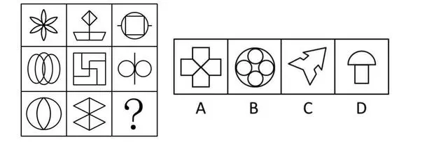

# 属性规律

1.  **图形特征**：元素组成不同

## 一、对称性

### 1、对称的类型

1.  （1）：一个图形如果沿一条直线对折后，两边部分能够完全重合，那该图形是轴对称图形，一个对称图形可能有 1 条或多条对称轴，如 A、B、C、Y、△、☾等。

2.  （2）：一个图形如果正着看和倒着看（即旋转 180°）一模一样，那么该图形是中心对称图形，如S、Z、N、平行四边形等。

3.  （3）：形象地说，就是以上两者特征的综合体，既能沿直线对折后重合，又能正看与倒看完全一样，如H、O、○等。

### 2、对称轴的方向和数量

1.  当题干图形和两个以上选项的图形都是轴对称图形时，很有可能通过对称轴的方向和数量来命题，因此，解题时也要注意这两点。

2.  （1）可分为：横轴对称、竖轴对称、斜轴对称

3.  （2）

4.  （3）

### 3、对称轴的扩展规律

1.  （1）

2.  （2）

3.  （3）

4.  （4）内外图形对称轴关系：内外分开看

5.  （5）多部分对称轴关系：平行、垂直、相交

6.  （6）对称轴两侧的形状

(2022北京)每道题包含两套图形和可供选择的4个图形。这两套图形具有某种相似性，也存在某种差异。要求你从四个选项中选择最适合取代问号的一个。正确的答案应不仅使两套图形表现出最大的相似性，而且使第二套图形也表现出自己的特征。

解析

2.  元素组成不同，优先考虑属性规律。
3.  观察发现，第一套三个图形分别是中心对称图形、轴对称图形、轴对称+中心对称图形。
4.  第二套图形应遵循此规律，分别是中心对称图形、轴对称图形，故？处应选择轴对称+中心对称图形，只有A项符合。

**例**：(2022江苏)请从所给的四个选项中，选出最恰当的一项填入问号处，使之呈现一定的规律性。

解析

2.  元素组成不同，优先考虑属性规律。
3.  观察发现，题干图形出现箭头、等腰元素图形，考虑对称性。
4.  题干每幅图都由内部和外部对称图形组成，因此分别画出每个图形的对称轴，发现每幅图的两条对称轴之间都是垂直关系，只有A项符合。

**例**：(2022国家)把下面的六个图形分为两类，使每一类图形都有各自的共同特征或规律，分类正确的一项是：

2.  A. ①②⑤，③④⑥
3.  B. ①③④，②⑤⑥
4.  C. ①⑤⑥，②③④
5.  D. ①②④，③⑤⑥

解析

2.  本题为分组分类题目。元素组成不同，优先考虑属性规律。观察可知，题干图形比较规整，考虑对称性。
3.  图①②⑤一组，对称轴穿过图中的两个交点；
4.  图③④⑥一组，对称轴穿过图中的两条线，并且这两条线和对称轴垂直，对应A项。
5.  故正确答案为A。

## 二、曲直性

1.  **1、全曲线**：图形里面全部是曲线。

2.  **2、全直线**：图形里面全部是直线。

3.  **3、半曲半直**：图形里面同时有直线和曲线。

4.  `注意由多部分组成的图形，考虑分开看。例如外部是全曲、内部是全直。`

**例**：(2016年河南)从所给的四个选项中，选择最合适的一个填入问号处，使之呈现出一定的规律性：

解析

1.  元素组成不同，考虑属性规律和数量规律。
2.  解法一：属性规律分为对称性、曲直性、封闭性，对称、封闭无明显规律，题干所有的图形都是直线图形，而选项A、C、D项含有曲线，故根据曲直性选择B选项。
3.  解法二：考虑数量规律。观察发现，每幅图形都是由两个相同的元素组成，第一幅图是两个四角形，第二幅图是两个三角形，第三幅图是两个六边形，第四幅图是两个长方形，？是也应是由两个相同的元素组成，即B选项，由两个带有直线的三角形组成。
4.  故正确答案为B。

### 1、曲直的位置规律

1.  （1）内直外曲、外直内曲、左直右曲、右直左曲、上直下曲、上曲下直

2.  （2）相离：曲线和直线在任何地方都没有接触。

3.  （3）相交：曲线和直线存在公共点。当题干当中的每幅图形都既有直线，又有曲线，并且存在明显的曲直相交叉，可以考虑数一下

4.  （4）相切：曲线和直线仅在一点上接触。。

**例**：(2018北京)从四个图中选出唯一的一项，填入问号处，使其呈现一定的规律性:

解析

2.  这道题有的同学可能先去想到对称性，但是第二组图形中的两个图都不对称，所以对称性没有规律；
3.  接下来我们发现，右边这组图形中的图1，就是很简单的1条直线和两条曲线相交叉，很明显在制造“曲直交点”，再观察其余图形，每幅图形中都有明显的曲线和直线，并且相交叉，所以优先考虑数曲直交点。
4.  左边这组图中，曲直交点数分别为2、3、4，右边这组途中，曲直交点数分别为2、3，所以问号处应该是曲直交点数为4。
5.  A选项曲直交点为6个，B选项为5个，C选项为4个，D选项为5个，所以答案选C。

**例**：(2023北京)每道题包含两套图形和可供选择的4个图形。这两套图形具有某种相似性，也存在某种差异。要求你从四个选项中选择最适合取代问号的一个。正确的答案不仅使两套图形表现出最大的相似性，而且使第二套图形也表现出自己的特征。

解析

2.  观察发现，题干每幅图均由1个圆和1条折线构成，可以考虑图形间位置关系。
3.  第一组的图形曲线和折线分别相离、相切、相交。第二组前两幅图的图形间关系也符合该规律，故“？”处图形的曲线和折线应相交，只有D项符合。
4.  故正确答案为D。

### 2、复合考法

1.  （1）题干中有单一直线、单一曲线，也有曲直相交叉，，那么很可能它就是把这几种规律进行复合考查，我们就把每种规律都数一下（比如求和、作差），如果单纯看某一种规律没有答案，就考虑讲多种规律复合来看。

**例**：(2020国考)从所给的四个选项中，选择最合适的一个填入问号处，使之呈现一定的规律性：

解析

5.  题干和选项，每幅图形都有单一的直线，曲线，也都有明显的曲线和直线相交叉，所以同时具有数直线数量、曲线数量和曲直交点的特征。我们可以分别将这几种规律数一下。
6.  首先数直线，图1到图5的直线数量分别为：4、3、7、7、6，没有规律；
7.  数曲线数量，分别为：2、3、1、2、4，也没有规律；
8.  直线数和曲线数进行简单的运算，也没有规律；
9.  接着考虑数曲直交点，分别为：4、6、2、4、8；
10.  这时候我们会发现，每幅图形的曲直交点数量都是曲线数量的2倍，所以问号处也应符合此规律。只有D选项满足，所以答案选D。

## 三、开闭性

1.  **1、题型特征**：元素组成不同；完整的图形留了小开口；生活化图形。

2.  **2、开闭性**：

    1.  （1）开放图形：图形不包含任何封闭空间，即没有“窟窿”，如字母 C。

    2.  （2）封闭图形：图形包含封闭空间，即有“窟窿”，如字母 D。

    3.  （3）半开半闭图形：图形既包含封闭空间又包含开放区域，如字母A

3.  **3、解题思路**：当图形元素组成不同时，常考查属性、数量及其他特殊规律。而属性规律的呈现方式更直观，特征辨别更容易，可优先考虑属性规律。常考的属性规律有三种：对称性、曲直性、开闭性。

**例**：（2019联考）请从所给四个选项中，选择最合适的一个填入问号处，使之呈现一定的规律性（ ）。

1.  
2.  A. ①③⑥，②④⑤
3.  B. ①③⑤，②④⑥
4.  C. ①④⑥，②③⑤
5.  D. ①②④，③⑤⑥

解析

6.  对称、曲直均无明显规律，考虑开闭性。
7.  图①④⑥均为半开半封闭图形；图②③⑤均为全封闭图形。因此①④⑥一组，②③⑤一组。
8.  故正确答案为C。

## 四、随笔练习

**例1**：(2018浙江选调)请从所给的四个选项中，选择最合适的一个填入问号处，使之呈现一定的规律性。

解析

2.  元素组成不同，优先考虑属性规律。
3.  题干图形，九宫格第一行图形对称轴都为0条、第二行图形对称轴都为1条、第三行前两幅图形对称轴都为2条，因此？处也应填入对称轴为2条的图形，只有A项符合。
4.  故正确答案为A。

**例2**：（2014上海）下列选项中，符合所给图形的变化规律的是：

解析

2.  各图形构成不同，且均有里外两个元素构成。分别观察，均为轴对称图形。
3.  考虑对称轴的数量或位置规律。外面图形的对称轴数量分别为：4、2、2；里面图形的对称轴数量分别为：3、1、1。每幅图里外图形对称轴数量差均为1。
4.  故正确答案为C。

**例3**：（2015黑龙江）从所给的四个选项中，选择最合适的一个填入问号处，使之符合已呈现的规律性：

1.  

解析

2.  题干为九宫格图形，考虑从找到规律。
3.  观察发现，九宫格，第三列图形均由曲线和直线两种元素构成，满足条件的只有D项。
4.  故正确答案为D。

**例4**：（2017联考）把下面的六个图形分为两类，使每一类图形都有各自的共同特征或规律，分类正确的一项是：

2.  A. ①②④，③⑤⑥
3.  B. ①②⑤，③④⑥
4.  C. ①③⑥，②④⑤
5.  D. ①⑤⑥，②③④

解析

6.  图形元素组成不同，属性无明显规律，考虑数量规律。整体观察图形，①②⑤均有3条曲线，③④⑥均有1条曲线。
7.  故正确答案为B。

**例5**：（2017黑龙江）从所给的四个选项中选择最合适的一个填入问号处，使之呈现一定的规律：

解析

2.  题干每幅图形的内部图形都有箭头，且箭头的方向每次逆时针旋转45度，据此排除B、C项；
3.  对比A、D选项，发现外框的曲直性明显不同，题干的图形外框的曲直性分别是全曲、全直、全曲、全直、全曲、？，？处应该选择外框是全直线的图，排除A选项。
4.  故正确答案为D。

**例6**：（2025浙江）从所给的四个选项中，选择最合适的一个填入问号处，使之呈现一定的规律性。

解析

2.  元素组成不同，且无明显属性规律。
3.  观察发现，题干图形均由直线和曲线构成，且直线和曲线出现明显相交，考虑曲直交点数。
4.  题干图形的曲直交点数均为2，故？处应选择有2个曲直交点的图形，只有D项符合。

**例7**：（2024河北事业单位）请从所给四个选项中，选择最合适的一个填入问号处，使之呈现一定的规律性（ ）。

解析

2.  元素组成不相同，优先考虑属性规律。
3.  观察发现，题干图形出现粗线条图形并且存在单一封闭区域，考虑开闭性。
4.  图一为封闭图形，图二为半开半闭图形，图三为封闭图形，图四为半开半闭图形，图五为封闭图形，故？处应选择半开半闭的图形，只有D项符合。

**例8**：（2019国考）从所给的四个选项中，选择最合适的一个填入问号处，使之呈现一定的规律性：

解析

2.  元素组成不同，优先考虑属性规律。
3.  观察发现，题干图形均为轴对称图形，并且对称轴方向每次顺时针旋转，排除A项和C项。
4.  进一步观察发现，题干中图1、图3和图5的对称轴都与图形中的一条线重合，而图2和图4的对称轴没有与图形中的一条线重合，故“？”处应选择一个图形的对称轴不与图形中某一条线重合的，只有B项符合。
5.  故正确答案为B。

**例9**：（2018浙江选调）把下面的六个图形分为两类，使每一类图形都有各自的共同特征或规律，分类正确的一项是：

2.  A.①③④，②⑤⑥
3.  B.①⑤⑥，②③④
4.  C.①④⑤，②③⑥
5.  D.①③⑤，②④⑥

解析

2.  元素组成不同，优先考虑属性规律。观察发现①③⑤图形中既包含直线又包含曲线，而②④⑥图形都是全直线图形，故图①③⑤为一组，图②④⑥为一组。
3.  故正确答案为D。

**例10**：（2024山东）把下面六个图形分为两类，使每一类图形都有各自的共同特征或规律，分类正确的一项是：

2.  A.①②③，④⑤⑥
3.  B.①②④，③⑤⑥
4.  C.①②⑥，③④⑤
5.  D.①③④，②⑤⑥

解析

2.  本题为分组分类题目。元素组成不同，优先考虑属性规律。题干出现若干生活化图形，且存在明显封闭与开放，优先考虑开闭性。观察发现，图①②⑥为全封闭图形，图③④⑤为半开半闭图形，故图①②⑥为一组，图③④⑤为一组。
3.  故正确答案为C。

**例11**：（2023江苏）请从四个选项中选出最恰当的一项填入问号处，使题干图形呈现一定的规律性。

解析

2.  解法一：元素组成不同，优先考虑属性规律。观察发现，图一、图三、图五均为全开放图形；图二、图四均为全封闭图形，故？处应该填入一个全封闭图形，排除C、D两项；继续观察发现，图二、图四均是关于竖轴对称的图形，只有A项符合规律。故正确答案为A。
3.  解法二：元素组成不同，优先考虑属性规律。观察发现，图一、图三、图五均为全开放图形；图二、图四均为全封闭图形，故？处应该填入一个全封闭图形，排除C、D两项；继续观察发现，图二、图四均是由直线和曲线构成的图形，只有B项符合规律。故正确答案为B。
4.  注：该题不是很严谨，两种解法都有合理和不合理之处，故不必太过纠结正确答案。
