# 样式规律

## 一、遍历

> 图形推理中的遍历指图形元素（形状、颜色、位置等）按照特定规律，在图形的不同部分或位置上重复出现或排列，强调元素的有序性和变化规则。

1.  **1、图形特征**：元素组成相似，相同元素多次出现，排列随意。

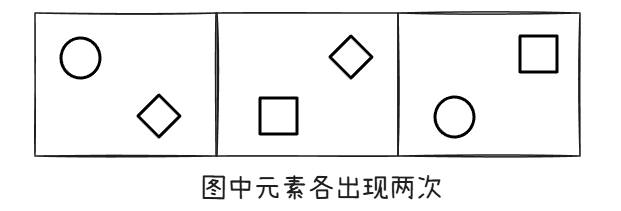

1.  **2、解题技巧**：缺啥补啥。

(2016年河南)从所给的四个选项中，选择最合适的一个填入问号处，使之呈现出一定的规律性。

1.  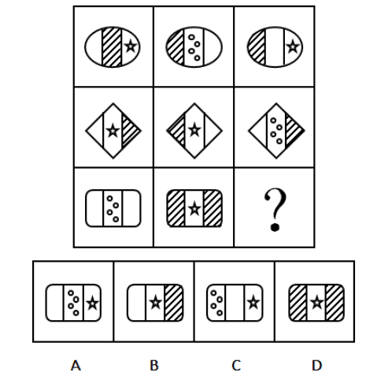

解析

6.  观察图形，第一、二行，每行图形都由轮廓相同的左、中、右三个部分构成，且每行图形，均出现三个“空白条”、三个“阴影图”、两个“星图”、一个“四个圆圈图”区域，因此考虑遍历规律。
7.  规律应用第三行中，还缺一个“空白条”、一个“星图”、一个“阴影图”区域，观察选项，只有选项B符合。
8.  故正确选项为B。

## 二、加减、同异

**图形特征**：元素组成相似，相同线条重复出现。

### 1、相加、相减

1.  （1）相加：保留两个图形的所有元素，相同的元素保留一个。
2.  （2）相减：减去相同的元素。
3.  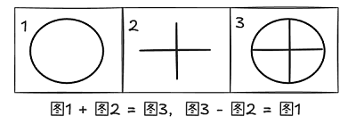

### 2、去同存异

1.  （1）去除图形中相同的元素，保留不同的元素。
2.  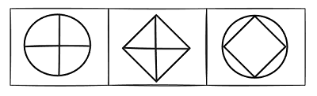

### 3、去异存同

1.  （1）去除图形中不相同的元素，保留相同的元素。
2.  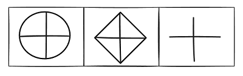

### 4、其他考法

1.  （1）**结合旋转的加减同异**：①先旋转再求异；②先求异再旋转；

2.  （2）**拆分思维**：图形拆分为多个部分每个部分运算不同。常考两部分，一部分求同，一部分求异。

3.  （3）**横竖线**：横线求同、竖线求异；横线求异、竖线求同。

4.  （4）**九宫格**：按行求异或按列求异；逆向求异（`图三和图二求异`）。

（2021上海）从所给的四个选项中，选择最合适的一个填入问号处，使之呈现一定的规律性：

1.  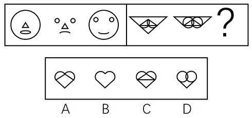

解析

6.  元素组成相似，线条重复出现，考虑样式规律。
7.  观察左侧第一组图发现，前两幅图去同存异，得到第三幅图。
8.  将此规律应用到右侧第二组图中，只有B项符合。
9.  故正确答案为B。

## 三、黑白块（球）专题

1.  **1、图形特征**：图形轮廓和分割区域相同，不同区域“黑白”颜色不同，黑白块数量不成规律。

2.  **2、考点**：

    1.  （1）对称性：黑/白块构成的图形轴对称、中心对称、对称轴方向依次旋转。

    2.  （2）一笔画：黑/白块组成的线段能够一笔画、两笔画。

    3.  （3）位置移动：黑/白块沿着内外圈不同规律旋转或者平移、斜着移动（注意移动步数和重合）。

    4.  （4）黑白运算：相同位置运算，比如：黑+白=黑、黑+黑=白；注意黑+白 =?和白+黑 =?的结果可能不一样。（`九宫格题型注意运算的方向，左到右或上到下`）

    5.  （5）黑白数量：单独数黑白数量；数量递增、递减；黑白数量的差值。

    6.  （6）黑白团：考察部分数、部分数递增。（`部分数指一个图形中独立且互不连接的组成部分数量，比如“品”由三个口组成，其部分数为3`）

    7.  （7）黑/白块周长或面积：1/4、一半、3/4；面积占比递增。

(2024江苏)从所给的四个选项中，选择最合适的一个填入问号处，使之呈现一定的规律性。

1.  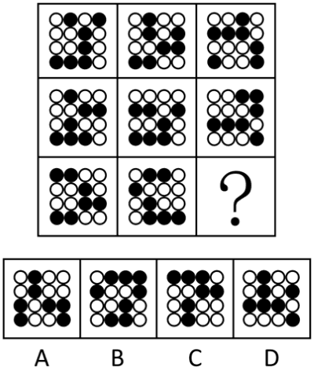

解析

6.  黑白块，考虑数量规律。
7.  九宫格优先横向看，观察发现，题干已知图形中黑球的数量均为7，排除B项。
8.  继续观察发现，题干已知图形中黑球和白球分堆明显，考虑部分数，题干已知图形中黑球和白球的部分数均为3，问号处图形也应遵循此规律，只有A项符合。

## 四、随笔练习

**例1**：(2017深圳)从所给四个选项中，选择最合适的一个填入问号处，使之呈现一定的规律性：

1.  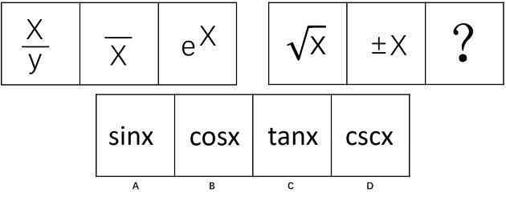

解析

2.  元素组成相似，考虑样式规律。
3.  第一组图中每幅图形中都含有X和横线（注意e的中间有横线），即第一组图形是X和横线的遍历。
4.  将此规律应用到第二组图形中，每幅图形都应该含有X和横线，而选项中只有C中含有X和横线（t含有横线）。
5.  故正确答案为C。

**例2**：(2023重庆选调)从所给四个选项中，选择最合适的一个填入问号处，使之呈现一定的规律性：

1.  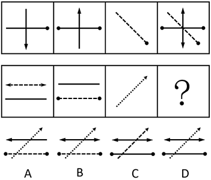

解析

2.  元素组成相似，且相同线条重复出现，优先考虑样式规律中的加减同异。
3.  观察发现，第一行中的图1、图2和图3相加得到图4；第二行应用此规律，只有D项符合。
4.  故正确答案为D。

**例3**：(2022江苏)请从所给的四个选项中，选出最恰当的一项填入问号处，使之呈现一定的规律性。

1.  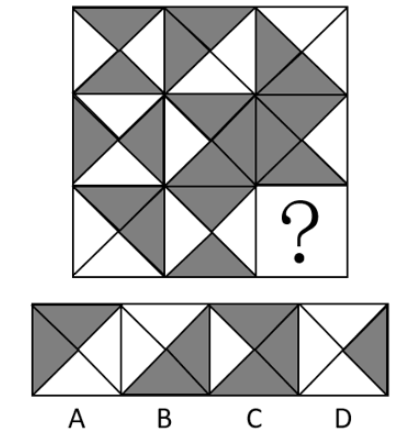

解析

2.  图形元素组成相似，优先考虑样式规律。
3.  题干图形存在黑色区域和空白区域，考虑黑白运算。
4.  九宫格优先横向观察，第一行图形的黑白运算规律为：黑+黑=白，白+黑=黑，黑+白=黑，白+白=白，第二行经验证符合此规律，第三行应用此规律，只有B项符合。

**例4**：(2017河南选调)从所给的四个选项中，选择最合适的一个填入问号处，使之呈现一定规律。

1.  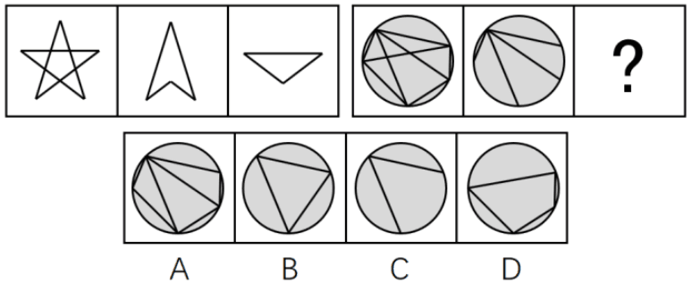

解析

2.  图形元素组成相似，考虑样式规律。
3.  在前一组图形中，第一个图形减去第二个图形得到第三个图形，后一组应该满足同样的规律。
4.  因为选项中都有圆形的外框，所以我们只需要考虑内部线条的关系，第一个图形减去第二个图形符合条件的只有D项。
5.  故正确答案为D。

**例5**：(2020天津)从所给四个选项中，选择最合适的一项填入问号处，使之呈现一定的规律性。

1.  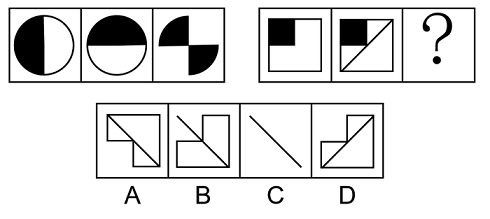

解析

2.  元素组成相似，相同线条重复出现，优先考虑加减同异。
3.  第一组图图1和图2求异，相同部分去掉，不同部分保留，再顺时针或者逆时针旋转90°得到图3；
4.  第二组图应用此规律，图一图二求异只剩下一条斜对角线，再旋转90°。
5.  C项为前两图求异后顺时针或者逆时针旋转90°，只有C项符合。

**例6**：(2021国家)从所给的四个选项中，选择最合适的一个填入问号处，使之呈现一定的规律性：

1.  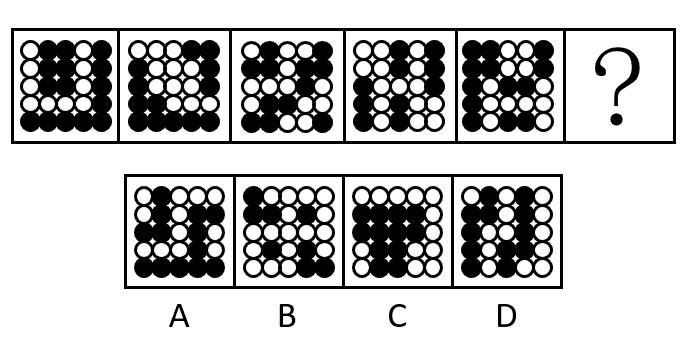

解析

2.  黑白块。观察发现，每幅图形整体并无规律，继续观察，每幅图形的白色区域分别是轴对称、中心对称、轴对称、中心对称、轴对称。
3.  因此？处白色区域应为中心对称图形。
4.  A项白色区域为中心对称图形，当选。
5.  B项白色区域为轴对称图形，C、D两项白色区域为非对称图形，均排除。
6.  故正确答案为A。

**例7**：(2019青海法院、检察院)从所给四个选项中，选择最合适的一个填入问号处，使之呈现一定规律性。

1.  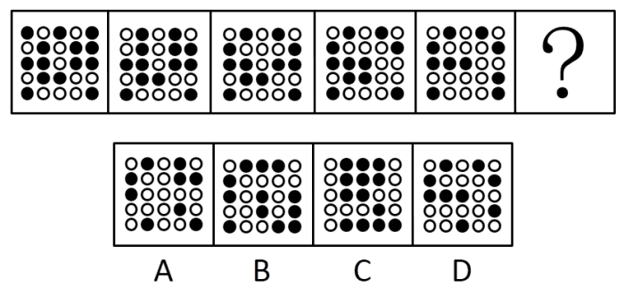

解析

2.  黑白块题型，每幅图都有小黑球，发现小黑球数量从图一到图五依次递减，分别为14、13、12、11、10，？处应选择一个9个黑球的，排除B、C两项。
3.  再次观察题干发现，图二和图一相比只有第一行颜色变动，其他行不变，图三和图二相比只有第二行颜色变动，其他行不变，图四和图三相比只有第三行颜色变动，其他行不变，图五和图四相比只有第四行颜色变动，其他行不变，因此问号处应该是第五行和前一幅图相比颜色变动，其他行不变。排除A项，只有D项符合。

**例8**：(2013广东)从所给的四个选项中，选择最合适的一个填入问号处，使之呈现一定的规律性：

1.  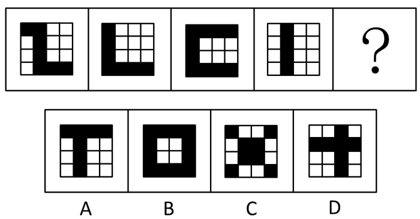

解析

2.  题干中黑色的方块都是首或尾连接，选项只有B是首尾相连，一笔画出。 故正确答案为B。

**例9**：(2012联考)从所给四个选项中，选择最合适的一个填入问号处，使之呈现一定的规律性：

1.  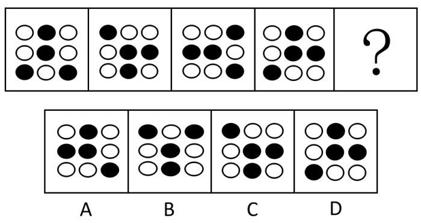

解析

2.  图形中正中间的小黑点一直保持不变，周围的小黑点围着正中间的小黑点逆时针平移一格。
3.  依照这个规律，正确答案应该是在第四幅图的基础上，外圈的黑点绕着中间黑点逆时针方向移动一格。
4.  只有B选项符合

**例10**：(2020年上海)下列选项中，与其他三个图形规律不同的是：

1.  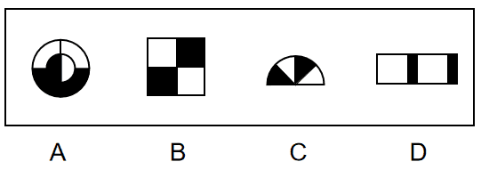

解析

2.  通过观察发现，题干图形均由黑块和白块组成，且色块分布均匀，考虑黑白块面积。
3.  A项、B项和C项中的黑块和白块面积相同，均占图形总面积的一半，而D项中白块的面积远大于黑块，故只有D项呈现的规律与其他三项不同。

**例11**：(2013浙江44%)请从所给的四个选项中，选择最合适的一个填入问号处，使之呈现一定的规律性：

1.  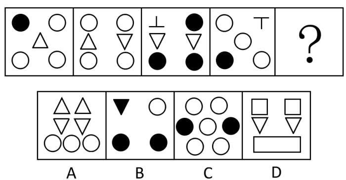

解析

2.  本题元素是集合形式，考查元素数量。已知每个图形中都包含三种不同的元素，且后一个图形包含了一种前面图形都没有的新元素，符合这一规律的只有B项。
3.  A项包含的元素在前面的图形中都出现过；
4.  C项只有两种元素；
5.  D项包含两种新的元素。
6.  故正确答案为B。
