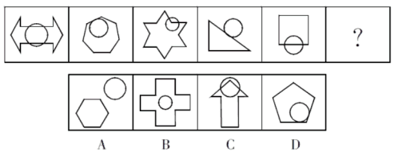
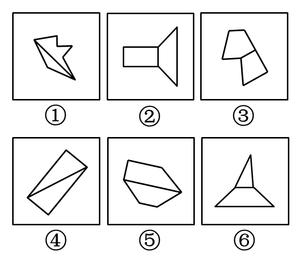
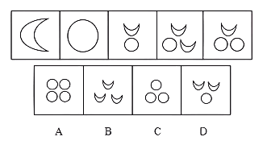
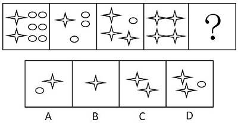
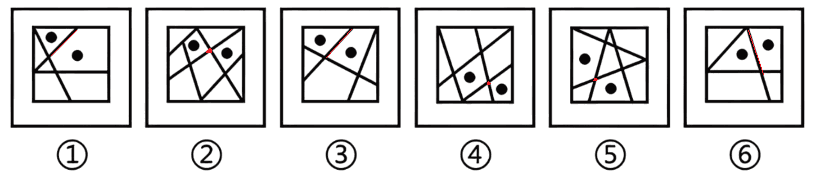
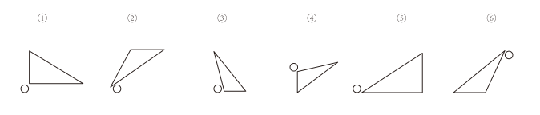
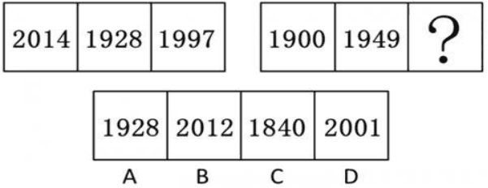
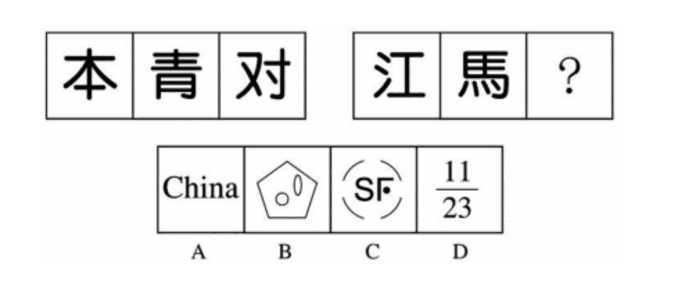
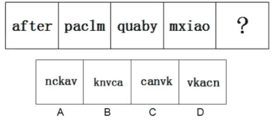

# 特殊规律

## 一、两图关系

1.  **1、图形特征**：题干多幅图都出现两个或多个封闭图形连在一起

2.  **2、考点**：

    1.  （1）相离：图形分开，没有公共部分
    2.  （2）相交：图形间有公共的封闭区间，可考察相交面的形状、面积。
    3.  （3）相切：图形间有公共线或公共点。
        1.  ①相切于点：可能考察交点位置（比如在图的左边、右边、上边）
        2.  ②相切于边：可能考察相交边的数量、相交边的样式（长/短；曲/直)

(2018国考)从所给的四个选项中，选择最合适的一个填入问号处，使之呈现一定的规律性：

1.  

解析

2.  元素个数较固定，优先考虑相交、相离和相接。
3.  第一个是相交，第二个是相切；第三个是相交；第四个是相切，第五个是相交。
4.  即奇数项都是相交，偶数项都是相切，故第六个需要填相切，只有D符合。故此题答案选D。

(2013国考)把下面的六个图形分为两类，使每一类图形都有各自的共同特征或规律，分类正确的一项是：

1.  

2.  A. ①③⑥，②④⑤

3.  B. ①②⑤，③④⑥

4.  C. ①②⑥，③④⑤

5.  D. ①④⑤，②③⑥

解析

6.  每组图形都是由两个图形连接而成，所以观察每组图形的关系特征。
7.  ①④⑤中两个图形的切线是两个元素最长的线段，②③⑥中两个图形的切线是两个元素最短的线段。
8.  正确答案为D。

## 二、元素换算

1.  **1、题目特征**：出现小元素、小图形，单纯的数小元素的种类和数量都无法选出唯一的答案，可以考虑元素换算。（`元素换算的题目出现的元素种类通常少于等于三种，以两种居多`）

2.  **2、解题技巧**：元素换算可以理解为用图形表示的数列。（`其实，就是用其中一种元素A来替代另一种元素B，然后来观察元素B的数量规律`）

    1.  （1）若无明显倍数关系 → 假设等差，比如图1+图3=2×图2
    2.  （2）若有明显倍数关系 → 假设等比

(2016江苏)从A、B、C、D四个选项中选出最合适的一个，使得它保持第一行图形所呈现的规律性（）。

1.  

解析

2.  观察发现：题干图形总共出现了2种元素，月亮和圆，且元素的数量无有效规律，考虑元素替换。
3.  尝试列等式，根据图1＋图3＝两倍图2，可得：2个月亮＋1个圆＝2个圆，即1个圆＝2个月亮；
4.  将题干图形均换算为月亮，则月亮的数量分别为：1、2、3、4、5；
5.  因此下一幅图形经换算后应含有6个月亮，选C。

(2012江西)从所给四个选项中，选择最合适的一个填入问号处，使之呈现一定的规律性：

1.  

解析

2.  图形均由小元素构成，优先考虑数量规律的素。
3.  观察发现元素种类和个数均无规律，但题干中一共只出现了2种小元素，考虑元素换算。
4.  观察发现，图1与图2的小元素成倍数关系，那么图2与图3也应满足此关系，即：1星＋3圆＝2（3星＋1圆），可得到换算公式为：1圆＝5星。
5.  代入题干，将圆全部换算为星得到的数量依次为：32、16、8、4、？，所以？处图形应有2个星。
6.  故正确答案为C。

## 三、功能标记

1.  **1、图形特征**： 当题干图形均含有某种相同小元素时，考虑功能元素。常考的功能元素有 小圆、小三角、黑点、箭头等。这些元素对图形有标记的作用。

2.  **2、考点**：

    1.  （1）标记在点上：交点
    2.  （2）标记在线上：直线、曲线、最长边、最短边
    3.  （3）标记在角上：直角、锐角、钝角、最大角、最小角。
    4.  （4）标记在面上：相交面、最大(小)面、直线面、曲线面。
    5.  （5）相对位置：上、下、左、右、内、外

（2024浙江）把下面的六个图形分为两类，使每一类图形都有各自的共同特征或规律，分类正确的一项是：

1.  
2.  A.①②⑥，③④⑤
3.  B.①③④，②⑤⑥
4.  C.①③⑥，②④⑤
5.  D.①④⑥，②③⑤

解析

6.  本题为分组分类题目。观察发现，每幅图形都有两个小黑点，优先考虑功能元素。
7.  图①③⑥中两个小黑点标记的两个面均相交于边，图②④⑤中两个小黑点标记的两个面均相交于点，即图①③⑥为一组，图②④⑤为一组。故正确答案为C。

(2018国考)把下面的六个图形分为两类，使每一类图形都有各自的共同特征或规律，分类正确的一项是：

1.  

2.  A.①③④，②⑤⑥
3.  B.①③⑥，②④⑤
4.  C.①②③，④⑤⑥
5.  D.①③⑤，②④⑥

解析

6.  本题为分组分类题目。观察发现每个图形都由一个小白球和一个三角形组成，考虑功能元素。
7.  功能元素具有标记位置的作用，每个小白球都挨着三角形的一个角，观察发现，①③④中小白球挨着的是三角形中最大的角，②⑤⑥中小白球挨着的是三角形中最小的角。即①③④一组，②⑤⑥一组。 故正确答案为A。

## 四、符号元素

1.  **1、数字**：封闭面、开口方向

2.  **2、字母**：封闭面、曲线直线、字母种类、字母位置顺序

3.  **3、文字**：面数、部分数、横线、竖线、点数、笔画数、共同的部分

4.  **4、Logo**：面数、部分数、种类、对称性

（2016广西）从所给四个选项中，选择最合适的一个填入问号处，使之呈现一定的规律性：

1.  

解析

2.  元素组成不同，优先考虑数量类或属性类。
3.  封闭性开放性特征明显，考虑属性类封闭性。
4.  第二步，两段式，第一段找规律，第二段应用规律。
5.  第一段中每幅图均由2 个全开放图形和 2 个有封闭空间的图形组成，第二段中前两幅图均由1 个全开放图形和 3 个有封闭空间的图形组成，依此规律，问号处应为 1 个全开放图形和 3 个有封闭空间的图形，只有 C 项符合。

（2017深圳）从所给四个选项中，选择最合适的一个填入问号处，使之呈现一定的规律性：

1.  

解析

2.  第一组3个汉字的部分数分别为1、2、3，第二组前两个汉字部分数为4、5，?应该选一个6个部分的，只有A符合。

（2015吉林）从所给四个选项中，选择最合适的一个填入问号处，使之呈现一定的规律性：

1.  

解析

2.  观察已知字母发现，每组字母中均有字母“a”，并且每个单词中的“a”字的位置依次在第1、2 3、4位，下一个应该在第5位，因此答案选B。

## 五、相邻比较

1.  **1、**“相邻比较”是指通过比较题干相邻的两幅图，寻找不同或者相同之处。

2.  **2、图形特征**：①图1和图2有明显较多相同处。②常规的思路无法解题。

3.  **3、解题思维**：比较相邻两个图找相同或不同。

    1.  （1）相同居多，找不同。
    2.  （2）不同居多，找相同。

（2014北京）从所给的四个选项中，选择最合适的一个填入问号处，使之呈现一定的规律性：

解析

2.  观察发现，题干为宫格型黑白球，先看小黑球数量是否一致确定考虑方向（同例1）。发现全都是6个小黑球，考虑位置规律。通过左边图形发现，有的小黑球位置变了，有的小黑球位置不变，没有规律。故本题用常规规律无法解题，考虑圈两幅图进行相邻比较。
3.  如下图所示：圈出图1和图2发现两幅图长得挺像的，考虑找不同。同样对于宫格型题干可以逐行去找不同。观察发现，从图1到图2，除了标红的小黑球位置发生了变化以外，其余小黑球位置保持不变。
4.  
5.  继续观察，从图2到图3，如下图所示：除了标黄的小黑球位置发生了变化以外，其余小黑球位置保持不变。
6.  
7.  因此，通过左边一组图能够找到规律：相邻两幅图之间有且仅有一个小黑球的位置发生了变化。
8.  右边用规律。从右边的图1到图2，如下图所示：除了标绿的小黑球位置发生了变化以外，其余小黑球位置保持不变。
9.  故“？”处要找的图形应该是与右边图2有且仅有一个小黑球位置发生变化。
10.  
11.  先不着急看选项，要找的图形与右边图2有且仅有一个小黑球位置发生变化，说明要找的图形跟图2长得很像，此时看选项能快速排除A、C。
12.  剩下B、D，观察发现，B选项与图2有两个小球的位置都不一样，排除；再去看D选项，与图2有且只有一个小黑球不一样，故正确答案为D。

（2015四川）从所给的四个选项中，选择最合适的一个填入问号处，使之呈现一定规律性：

解析

2.  首先观察图形特征，发现每幅图都是由多个独立的小元素组成，考虑数元素的种类和数量。数完发现题干全都是3个、3种元素，看选项，可以排除C选项，剩下A、B、D选不出唯一答案。
3.  此时发现，无路可走，常规规律走不通，可以考虑圈两幅图进行相邻比较。
4.  
5.  圈出来之后，发现两幅图长得不像，差异比较大，所以我们优先找相同。从图1到图2，发现有一个相同的小元素“”；从图2到图3，有一个相同的小元素“”；从图3到图4，有一个相同的小元素“”。
6.  故本题规律为：相邻两幅图之间有且仅有一个共同的小元素。因此，“？”处要找的图形应该是与图4有一个相同的小元素，观察选项，只有A项符合要求，故正确答案为A。
