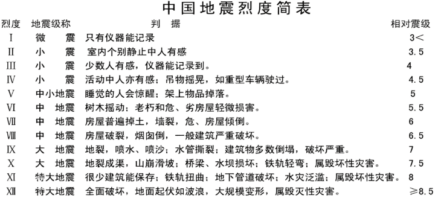

# 地理知识

### 一、天体系统

1.  **恒星**：能够自己发光发热的星体，比如太阳和大多数发光的星星。

2.  **星座**：恒星组合，天空分为 88 个正式星座。

3.  **星宿**：

    1.  （1）一宿通常包含一颗或者多颗恒星；
    2.  （2）四大星野（四象）：青龙、白虎、朱雀、玄武；
    3.  （3）春秋时细分为青龙七宿、朱雀七宿、白虎七宿、玄武七宿共二十八宿；
    4.  （4）斗宿又称斗木獬，北方七宿第一宿，位于人马座，其中主星官斗包含6颗星，即南斗六星，与北斗七星遥相呼应。

1.  **北斗七星**：是夜空中的七颗亮星，按顺序依次命名为大熊座α、大熊座β、大熊座γ、大熊座δ、大熊座ε、大熊座ζ、大熊座η，古时汉族天文学家分别把它们称作：天枢、天璇、天玑、天权、玉衡、开阳、瑶光。它们组成的图形像是古代舀酒的斗，故命名为北斗七星。

    1.  （1）最亮的是玉衡星，最暗的是天权星；
    2.  （2）开阳星和辅星组成光学双星，肉眼即能辨识；
    3.  （3）北斗七星的相对位置是变化的。
    4.  （4）玉衡、开阳、摇光三星排列成弧状，形如酒斗之柄，称为斗柄。古人根据初昏时斗柄所指的方向来决定季节：斗柄指东，天下皆春；斗柄指南，天下皆夏；斗柄指西，天下皆秋；斗柄指北，天下皆冬。
2.  **行星**：按接近圆形轨道绕恒星旋转的星体。

3.  **八大行星由离太阳从近到远的顺序**：水星、金星、地球、火星、木星、土星、天王星、海王星。

    1.  水星：最小；古代称为“辰星"或“昏星”。
    2.  金星：轨道最近，正圆逆向自转；古代称之为长庚、启明、太白或太白金星。
    3.  地球：有生命
    4.  火星：与地球最相似；古代被称为“荧惑星”。
    5.  木星：最大、有光环
    6.  土星：光环最美
    7.  天王星：有光环
    8.  海王星：最远
4.  **彗星**：俗称“扫帚星”。按抛物线轨道与恒星擦肩而过，或者按曲率很大的椭圆轨道绕恒星转动的星体。是由水、尘埃、冻结的气体（甲烷、氨等）构成的，当靠近太阳时，因被加热，冰化成水蒸气而形成彗尾。

    1.  `哈雷彗星每 76.1 年环绕太阳一周，下次过近日点时间为2061 年7月28日。世界最早的彗星记录是《春秋》中记录：“秋七月，有星孛入于北斗”`
5.  **卫星**：绕行星转动的星体，比如月亮、人造卫星、木星的各个卫星。

6.  **流星**：在划过大气层时发光发亮的星体。世界上最早记录流星雨的著作是《竹书纪年》；关于流星雨最详细的记录是《左传》。

7.  **黑洞**：一种引力极强的天体，连光也不能逃脱，但黑洞也会释放出部分射线，是科学家首先从理论上进行预言的特殊天体。

8.  **太阳**：太阳系中心天体，银河系的一颗普通恒星。与地球平均距离 14960 万千米。太阳的质量约占太阳系总质量的 99.8%。太阳的分层为核心层、辐射层、对流层、光球层、色球层、日冕层。

9.  **太阳能**：太阳巨大的能量来源于氢转化为氦的热核反应（核聚变）。

10.  **太阳黑子**：是指太阳的光球表面有时会出现一些暗的区域，它是磁场聚集的地方。太阳黑子的影响：

     1.  （1）对地球的磁场和电离层产生干扰，无线电通讯受到严重影响或中断；
     2.  （2）引起地球磁暴现象，导致气候异常，地球上微生物大量繁殖。
11.  **耀斑**：耀斑的产生源于磁场能量的快速释放，发生在色球层，会严重干扰电离层对电波的吸收和反射作用，使得部分或全部短波无线电波被吸收掉，短波衰弱甚至完全中断。

12.  **太阳风**：太阳风即太阳风暴，是太阳黑子活动高峰阶段射出的超音速高能带电粒子流。太阳风的影响：

     1.  ①影响地球空间环境，破坏臭氧层；
     2.  ②促成彗星彗尾的形成；
     3.  ③太阳风轰击两极的高层大气时会发出光芒，形成极光；
     4.  ④干扰卫星通讯，影响卫星运行。
13.  **极光**：极光产生的条件为大气、磁场、太阳风，三者缺一不可，极光发生在电离层。是一种绚丽多彩的发光现象，其发生是由于太阳带电粒子流（太阳风）进入地球磁在地球南北两极附近地区的高空，夜间出现的灿烂美丽的光辉

14.  **天文单位**：地球到太阳的平均距离为 1.5 亿千米，被定义为一个天文。

15.  **光年**：距离单位，是光在真空中传播一年（365.25 天）所经过的距离，由于带有“年”字，常被误认为是时间单位。约为 9.46×1012千米。

16.  **重要经纬线**：本初子午线（0°经线，穿越英国格林尼治天文台）、国际日期变更线（太平洋中的180°经线）、热带与温带的分界线（南北回归线）

17.  **月球**：也叫月亮、银钩、玉钩、玉弓、玉轮、银盘、蟾宫、桂宫、广寒、婵娟、望舒。是地球唯一的天然卫星。离地球最近的天体，人类探索宇宙星际航行第一站。

     1.  （1）月球绕地球公转，造成月圆月缺。月球自转方向与公转方向均为自西向东。自转周期与公转周期都大约为 27 天 7小时，故月球是一颗同步卫星。

     2.  （2）月球表面无大气层、无液态水、没有磁场、没有空气，声音不能传播。

     3.  （3）月球核心分为月海（暗黑、平坦的低洼区域，富含铁、钛的玄武岩，集中在月球正面，占月表面积约 17%）、月陆（明亮、崎岖的高地，富含硅、铝的斜长岩，月球背面更密集，占月表面积约 83%）两大区域：

     4.  （4）月球引力只有地球的六分之一。

     5.  （5）表面布满环形山，由陨石撞击形成。

     6.  （6）月球是地球唯一的天然卫星，月亮本身不发光，反射的是太阳的光。地球海洋潮汐的产生主要是由于月球引力的作用。

     7.  （7）月球最古老、最大的撞击遗迹是南极-艾特肯盆地，位于月球背面。

     8.  （8）满月是天文学现象，指月球与太阳黄经相差180度时的天体现象，即地球位于太阳和月球之间（三者近似直线），亦称“望”。此时被太阳照亮的月面完全朝向地球，多出现于农历十四至十七。

18.  **潮汐**：海水在月球和太阳（主要是月球）引潮力作用下所产生的周期性运动。

     1.  `天下第一潮，北宋潘阆《观潮》中名句：来疑沧海尽成空，万面鼓声中。`
19.  **月相变化的周期**：一个朔望月，即 29.53 天（新月——上弦月——满月——下弦月——新月）。

20.  **日食**：太阳、月球、地球运行到同一直线上，月球挡住了太阳光。月球在太阳和地球的中间。最早的日食记录见于中国《尚书》。夏、商、周断代工程利用了中国古籍中丰富的日食记录。

     1.  日食包括：日偏食、日全食、日环食：月食包括：月偏食、月全食、半影月食。
     2.  时间：只发生在朔，即农历初一，但并不是每次朔都会发生
21.  **月食**：太阳、地球、月球恰好在同一直线上，地球在中间，月球被地球的影子遮掩而发生。公元前 2283 年美索不达米亚的月食记录是世界最早的月食记录，其次是中国于公元前1136年的月食记录。东汉时，张衡从日、月、地球所处的不同位置，对月食作了最早的科学解释。

     1.  月食包括：月偏食、月全食和半影月食。地球直径是月球的 4 倍，因此不能形成环食
     2.  时间：月食只可能发生在农历十五前后，即“望日”

### 二、地球

1.  **地球圈层划分依据**：地震波(地震波可分为纵波和横波，纵波传播快，横波传播慢)

2.  **地球内部构造**：地球内部由内到外分为三层，地核、地幔和地壳。

3.  **地球主要元素含量顺序**：氧硅铝铁钙

4.  **板块运动**：是指地球表面一个板块对于另一个板块的相对运动。世界分为六大板块，分别是亚欧板块、非洲板块、美洲板块、太平洋板块、印度洋板块、南极洲板块。

    1.  （1）青藏高原是印度洋板块向亚欧板块俯冲，地壳隆起而形成的。

    2.  （2）东非大裂谷是由非洲板块张裂形成的。

    3.  （3）由于板块运动，南极洲现在没有森林，但冰原下有丰富的煤炭。

5.  **地震**：大地振动是地震最直观、最普遍的表现。‌在海底或滨海地区发生的强烈地震，能引起巨大的波浪，称为海啸。

6.  

7.  **地震自救**：

    1.  为防止次生灾害的发生，首先要切断电源、气源，防止火灾发生
    2.  抓紧时间逃到室外空旷处，切忌躲到高大建筑物、窄小胡同、陡山坡及河岸边
    3.  来不及时，承重墙墙根、墙角，有水管和暖气管道等处是合适的避震空间。
    4.  住单元楼内，可选择开间小的卫生间、厨房、储藏室及墙角躲避
8.  **地轴与两极**：地轴穿过地心，与地球表面相交于两点。指向北极星附近（即北方）的一点叫北极；与北极相反的一点叫南极。

9.  **经线**：又叫子午线，是在地面上连接两极的线，指示南北方向。东西半球分界线为 160°E 和 20°W 构成的经线圈是东西半球的分界线。

10.  **纬线**：用于指示东西方向，纬线是圆，纬线圈由赤道向两极缩小，其中最长的纬线是 0°纬线圈，既赤道，把地球分为南北两半球。南、北纬 23°26′的两条纬线圈，称为南/北回归线，是热带和温带的分界线。

11.  **赤道**：赤道把地球分为南北两半球，其以北是北半球，以南是南半球，是划分纬度的基线，赤道的纬度为 0°，赤道是南北纬线的起点，是地球上最长的纬线，赤道也是地球上重力最小的地方。

12.  **公转**：地球环绕太阳的运动称为地球公转。地球公转的意义为四季更替，南、北半球四季相反。

13.  **自转**：地球自转的方向是自西向东转，从北极点上空看呈逆时针旋转，从南极点上空看呈顺时针旋转，地球自转的周期是一个行星日，目前其值为 23 时 56 分 4 秒，赤道的线速度是最大的，两极的线速度最小。

     1.  地球自转的意义
     2.  1、南、北半球发生昼夜交替
     3.  2、不同地方的时间差异
         1.  （1）经度不同，地方时不同，经度相差 15 度，时间相差 1 小时，相差一度，时间相差4 分钟
         2.  （2）全球被划分为 24 个时区
         3.  （3）各时区区时采用本时区中央经线（时区数乘以 15 度）的地方时

### 三、大气与气候

1.  **大气组成**：78%氮气（N2）、21%氧气（02）以及惰性气体、水蒸气、二氧化碳、臭氧、固体杂质等。

2.  **大气垂直分层**：

    1.  （1）对流层：空气对流明显，气温随高度增加而降低，会发生雨、雪、云、雾、雹、霜、雷、电等主要天气现象，它的高度因纬度而不同，在低纬度地区平均高度为 17～18 公里，在中纬度地区平均为 10～12 公里，极地平均为 8～9 公里，并且夏季高于冬季

    2.  （2）平流层：大气平稳流动，天气晴朗，温度随高度增加而升高，飞机飞行的理想空间，位于离地表 10 公里至 50 公里的高度

    3.  （3）臭氧层：平流层的一部分，能吸收阳光中对生物有害的短波紫外线。

    4.  （4）高层大气：空气垂直对流强烈，温度随高度增加而降低，空气电离程度强烈，极光出现在中间层，它在自平流层顶到 85 千米之间的大气层

3.  **热力环流**：由于地面冷热不均而形成的空气环流。具体体现：

    1.  （1）海陆风：日间海面上气温低于陆地，而夜间高于陆地。气温差带来了近地面大气的密度和气压差，气压梯度力推动气流由高压（低温）区域向低压（高温）区域运动

    2.  （2）城市风：城市热岛

    3.  （3）山谷风：日间由山谷向山坡运动的上坡风以及在夜间由山坡向山谷运动的下坡风。

4.  **风的形成**：由太阳辐射热引起（`根本原因`）的。是水平气压梯度力（`直接原因`）、地转偏向力、摩擦力共同作用的结果。

5.  **降水类型**：

    1.  （1）垂直降水：由空中降落到地面上的水汽凝结物，如雨、雪、雹、雨淞
    2.  （2）水平降水：由大气中水汽直接在地面或地物表面及低空的凝结物，如霜、露、雾、雾淞
6.  **雨的类型**

    | 类型 | 成因 | 表现 |
    | --- | --- | --- |
    | 对流雨 | 因高温使得蒸发旺盛，富含水汽的气流剧烈上升，至高空因减压膨胀冷却而成云致雨，强度大、雨量多、雨时短、雨区小 | 赤道全年下对流雨，温带出现于夏季午后 |
    | 锋面雨 | 锋面活动时，暖湿气流上升，水蒸气遇冷凝结成雨，雨带常随锋面的季节性移动而移动 | 长江中下游地区的梅雨、“清明时节雨纷纷”都是锋面雨 |
    | 地形雨 | 潮湿气团前进时，遇到高山阻挡，气流被迫缓慢上升，引起绝热降温，水蒸气凝结成雨 | 发生在迎风坡，如喜马拉雅山脉南坡的雨； |
    | 台风雨 | 热带海洋上的风暴带来的降雨 | 常见于我国广东、福建沿海； |

7.  **梅雨**：是指每年公历6月上旬至七月中旬，在湖北宜昌以东28°N-34°N之间的江淮流域到日本南部这一狭长区域常会出现的连阴雨天气，雨量很大。由于这一时期正是江南梅子的黄熟季节，故称为 “梅雨”。

8.  **风**：是由空气流动引起的一种自然现象，它是由太阳辐射热引起的。水平气压梯度力是形成风的直接原因，等压线愈密风速愈大。

9.  **大气温度**：午后 2 时左右最高，日出前后最低。

10.  **形成雨、雪、冰雹的必要条件**：一是水汽饱和：二是大气中有足够的凝结核（其化学成分很复杂，最常见的是氯、氮、碳、镁、钠、钙等化合物）。

11.  **形成露和霜的气象条件**：晴朗微风的夜晚。

12.  **彩虹**：由外圈至内圈呈红、橙、黄、绿、蓝、靛、紫等各种颜色。霓的颜色排列次序跟彩虹相反。

13.  **气候类型**：

     1.  | 气候类型 | 气候特征 | 代表城市 |
         | --- | --- | --- |
         | 热带雨林气候 | 全年高温多雨 | 新加坡\\基多 |
         | 热带草原气候 | 干季湿季明显交替 | 巴西利亚 |
         | 热带季风气候 | 全年气温高，夏季降水多，冬季降水少 | 孟买 |
         | 热带沙漠气候 | 常年干旱少雨，气温极高 | 阿斯旺\\利雅得 |
         | 亚热带季风气候 | 夏热冬温，夏季降水多，冬季降水少 | 上海\\东京 |
         | 地中海气候 | 就北半球而言，夏季干旱炎热，冬季暖湿多雨 | 罗马\\洛杉矶 |
         | 温带季风气候 | 冬夏风向明显交替。冬季寒冷干燥，夏季暖热多雨 | 北京 |
         | 温带大陆性气候 | 终年干旱少雨 | 乌鲁木齐\\莫斯科 |
         | 温带海洋性气候 | 终年湿润，气温年变化较小 | 伦敦\\惠灵顿 |
         | 高原和山地气候 | 气候垂直变化明显，日照强，风力大 | 拉萨 |

14.  **厄尔尼诺现象**：又称圣婴现象，主要指太平洋东部和中部的热带海洋的海水温度异常地持续变暖，使整个世界气候模式发生变化，造成一些地区干旱而另一些地区又降雨量过多。

15.  **拉尼娜现象**：与厄尔尼诺现象正好相反，是太平洋中东部海水异常变冷的情况。我国易出现冷冬热夏，登陆我国的热带气旋个数比常年多，出现“南旱北涝”现象。

16.  **干旱、洪涝、寒潮、台风**：是我国最为常见、危害程度较为严重的气象灾害。旱涝灾害是我国发生最频繁、影响最大的灾害天气。侵入我国的寒潮，主要是在北极地带、俄罗斯的西伯利亚以及蒙古国等地暴发南下的冷高压。

17.  **台风**：指形成于热带或副热带 26℃以上广阔海面上的热带气旋。中心持续风速在 12级-13 级的热带气旋为台风或飓风。

18.  **冰雹**：冰雹是一种坚硬的球状、锥状或形状不规则的固态降水。冰雹多发生于夏季或春夏之交的雷暴天气。

19.  **夏至**：太阳直射北回归线，北半球太阳高度角最大，一年中影子最短，白昼时间最长。

20.  **冬至**：太阳直射南回归线，北半球太阳高度角最小，一年中影子最长，白昼时间最短。

### 四、地质与海洋

1.  **风化**：地表或接近地表的常温条件下，岩石在原地发生的崩解或蚀变。

2.  **风力**：风的侵蚀，堆积，搬运作用。

3.  **岩浆岩**：黄岗岩、玄武岩、流纹岩

4.  **沉积岩**：石灰岩、页岩、砂岩、砾岩

5.  **变质岩**：大理岩、石英

6.  **雅丹地貌**：指在干旱地区，由风力和流水共同作用（风蚀为主）形成的垄脊、沟槽、土墩等地貌组合。早期维吾尔牧羊人称此类地形为“雅丹”，意思是“具有陡壁的小山丘”。 例新疆罗布泊地区、吐鲁番、甘肃敦煌的玉门关雅丹魔鬼城、乌尔禾魔鬼城（新疆克拉玛依）。

7.  **冰川地貌**：由冰川（巨大的、缓慢移动的冰体）的侵蚀、搬运和堆积作用形成的地貌。分为冰蚀地貌和冰碛地貌。例现代冰川区（如喜马拉雅山、天山、阿尔卑斯山、阿拉斯加、格陵兰岛、南极洲）；古冰川作用区（如北欧、北美五大湖区域、中国青藏高原东部边缘、庐山、黄山等中低纬高山曾发育古冰川处）。

8.  **丹霞地貌**：丹霞地貌是指由产状水平或平缓的层状铁钙质混合不均匀胶结而成的红色碎屑岩（主要是砾岩和砂岩），以陡崖坡为特征的流水侵蚀地貌。由我国地质学家冯景兰和陈国达命名（源自广东丹霞山）。2010 年“中国丹霞”入选世界自然遗产。例贵州赤水丹霞、湖南峎山、福建武夷山、江西龙虎山、甘肃张掖、广东丹霞山、美国科罗拉多大峡谷属于典型的丹霞地貌。

9.  **喀斯特地貌**：喀斯特地貌又叫岩溶地貌，指可溶性岩石（主要是石灰岩、白云岩、石膏、岩盐等）在水（地表水和地下水）的溶蚀（化学溶解）作用为主，伴随流水侵蚀、重力崩塌等作用下形成的地貌。国际上通称“Karst”。例桂林山水、贵州荔波、重庆武隆、贵州黄果树瀑布、云南石林、四川九寨沟是著名的喀斯特景观。

10.  **三大地震带**：环太平洋地震带（世界上最大的地震带）、欧亚地震带、海岭地震带。

11.  **根据火山活动情况分类**：活火山（如富士山）、死火山（如乞力马扎罗山）、休眠火山（如长白山天池）。

12.  **按照性质，洋流分为暖流和寒流**：从水温高的海区流向水温低的海区的洋流，叫做暖流。反之，从水温低的海区流向水温低的海区的洋流，叫做寒流。

13.  **全球四大渔场分为两类**：一类是分布在寒暖流交汇的地方（日本的北海道渔场、加拿大的纽芬兰渔场、英国的北海渔场），另一类是分布在上升补偿流的地方（秘鲁渔场）。

### 五、世界自然地理

6.  **七大洲**：亚洲、欧洲、非洲、北美洲、南美洲、大洋洲、南极洲。面积最大的是亚洲，面积最小的是大洋洲。人口最多的是亚洲，国家最多的是非洲， 南极洲的平均海拔最高。
    1.  （1）亚洲：喜马拉雅山脉（世界最高的山脉）、死海（世界陆地的最低点、世界盐度最高 的水体）、贝加尔湖（世界上最深的湖、容量最大的淡水湖）、青藏高原（世界上最高的高原）、阿拉伯半岛（世界上最大的半岛）、马来群岛（世界最大的群岛）。

    2.  （2）非洲：尼罗河（世界上最长的河流）、撒哈拉沙漠（世界最大的沙漠）、东非大裂谷（世界最大的大裂谷）。

    3.  （3）欧洲：阿尔卑斯山脉（欧洲最大的山脉）、伏尔加河（俄罗斯的“母亲河””）、多瑙河（流经国家最多）、莱茵河（西欧第一大河）、泰士河（英国的“母亲河”）。

    4.  （4）北美洲：格陵兰岛（世界最大的岛屿，丹麦属地，爱斯基摩人）、科迪勒拉山系（世界最长的山系，纵贯南北美洲大陆西部）。

    5.  （5）南美洲：巴西高原（世界最大的高原）、亚马逊平原（世界面积最大的平原）、安第斯山脉（世界上最长的山脉）、亚马逊河热带雨林（是全球最大及物种最多的热带雨林，被称为“地球之肺”）、亚马逊河（世界流量、流域最大的、支流最多的河流）。

7.  **四大洋**：太平洋、印度洋、大西洋、北冰洋。其中面积最大的是太平洋，面积最小的是北冰洋。
8.  **分界线**：
    1.  （1）欧洲与亚洲：乌拉尔山、乌拉尔河、大高加索山脉、土耳其海峡。

    2.  （2）亚洲与非洲：苏伊士运河。

    3.  （3）北美与南美\*：巴拿马运河

* * *

10.  **里海**：在亚洲欧洲交界，是世界第一大湖、最大的咸水湖，称为“天然水库”。

11.  **四大洋**：太平洋、 印度洋、 大西洋、 北冰洋。 其中面积最大的是太平洋， 占世界海洋总面积的 49.8％， 占地球总面积的 35％， 面积最小的是北冰洋。

12.  **五大淡水湖**：在加拿大和美国交界处，按大小分别为苏必利尔湖、休伦湖、密歇根湖、伊利湖和安大略湖。除密歇根湖以外，其它四个为美国和加拿大共有的。

13.  **黑海**：黑海位于欧洲和亚洲之间，通过土耳其海峡与地中海相连接。流入黑海的重要河流有多瑙河和第聂伯河。沿海国家有土耳其、保加利亚、罗马尼亚、乌克兰、俄罗斯和格鲁吉亚。

14.  **地中海**：是欧洲、非洲和亚洲大陆之间的一块海域，由北面的欧洲大陆、南面的非洲大陆和东面的亚洲大陆包围着，西面通过直布罗陀海峡与大西洋相连，是世界最大的陆间海。地中海沿岸国家包括欧洲的西班牙、法国、意大利、希腊，亚洲的土耳其、叙利亚、黎巴嫩、以色列，非洲的埃及、阿尔及利亚等。

15.  **马六甲海峡**：是连接太平洋与印度洋的战略交通要道，沟通欧洲、亚洲和非洲的海上交通纽带，是东南亚的“十字路口”。

16.  **白令海峡**：一是沟通北冰洋和太平洋的唯一航道；二是北美洲和亚洲大陆间的最短海上通道及洲界线；三是俄美两国的分界线；四是国际日期变更线的通过处。

17.  **麦哲伦海峡**：沟通大西洋和太平洋；

18.  **直布罗陀海峡**：沟通地中海和大西洋；

19.  **曼德海峡**：连接红海和亚丁湾、印度洋；

20.  **霍尔木兹海峡**：连接波斯湾和阿拉伯海，是波斯湾到印度洋之间的必经之地，“石油生命线”。

21.  **德雷克海峡**：赴南极科学考察必经之路。

22.  **台湾海峡**：东海和南海间的航运要冲。

23.  **苏伊士运河**：苏伊士运河是沟通地中海与红海的著名国际通航运河，是亚洲、非洲、欧洲通往印度洋和北大西洋的海上捷径。

24.  **巴拿马运河**：是沟通太平洋和大西洋的国际运河和海上交通捷径。

25.  **世界之最**:

     <table><tbody><tr><td><b>最大的平原</b></td><td>亚马孙平原</td><td><b>最大的高原</b></td><td>巴西高原</td></tr><tr><td><b>最大的内海</b></td><td>地中海</td><td><b>最高的高原</b></td><td>青藏高原</td></tr><tr><td><b>最大的湖泊（咸水湖）</b></td><td>里海</td><td><b>最大的淡水湖</b></td><td>苏必利尔湖</td></tr><tr><td><b>最深的湖泊（淡水湖）</b></td><td>贝加尔湖</td><td><b>最深的海沟</b></td><td>马里亚纳海沟</td></tr><tr><td><b>最大的沙漠</b></td><td>撒哈拉沙漠</td><td><b>最长的裂谷带</b></td><td>东非大裂谷</td></tr><tr><td><b>最大的岛屿</b></td><td>格棱兰岛</td><td><b>最大的半岛</b></td><td>阿拉伯半岛</td></tr><tr><td><b>最大的盆地</b></td><td>刚果盆地</td><td><b>最高的山峰</b></td><td>珠穆朗玛峰</td></tr><tr><td><b>最长的内流河</b></td><td>伏尔加河</td><td><b>流经国家最多的河流</b></td><td>多瑙河</td></tr><tr><td><b>最深咸水湖（海拔最低）</b></td><td>死海</td><td><b>最高的湖泊（咸水湖）</b></td><td>西藏纳木错</td></tr><tr><td><b>盐度最大</b></td><td>死海</td><td><b>盐度最小</b></td><td>波罗的海</td></tr><tr><td><b>世界第一大流动沙漠</b></td><td>阿拉伯大沙漠</td><td><b></b></td><td></td></tr></tbody></table>

* * *

1.  **多瑙河**：位于欧洲，由西北向东南流入黑海，是欧洲第二长河，是世界上流经国家最多的河流。多瑙河发源于德国黑林山，流经德国、奥地利、斯洛伐克、匈牙利、塞尔维亚和黑山、克罗地亚、保加利亚、罗马尼亚、乌克兰等 9个国家。

2.  **尼罗河**：世界最长的河流，全长约6670公里。发源于非洲东北部，自南向北流经布隆迪、卢旺达、坦桑尼亚、乌干达、埃塞俄比亚、苏丹和埃及，最终注入地中海。‌‌

3.  **伏尔加河**：欧洲最长的河流，世界最长的内流河。自北向南流，注入里海，被俄罗斯人称为“母亲河”。

4.  **印度河**：自东北向西南流，注入阿拉伯海，位于巴基斯坦。

5.  **恒河**：北→西北→东南注入孟加拉湾，印度视为圣河。

6.  **亚马孙河**：世界水量最大河流。西→东注入大西洋

7.  **两河流域**：西亚水量最大。西北→东南注入波斯湾。

8.  **湄公河**：西北向东南，注入南海，东南亚第一大河。

### 六、世界人文地理

1.  **面积居世界前六位的国家**：俄罗斯、加拿大、中国、美国、巴西、澳大利亚。

2.  **面积最小的国家**：梵蒂冈。

3.  **主要国家**：泰国（千佛之国 ）、新加坡（“亚洲的十字路口””）、印度尼西亚（“火山国”世界最大的群岛国家）、印度（“孔雀之国”、世界办公室）、哈萨克斯坦（世界面积最大的内陆国）、俄罗斯（世界上跨经度最大的国家、世界上民族最多的国家）、荷兰（风车王国、郁金香、“海上马车夫”）、加拿大（枫叶之邦）、智利（世界上最狭长的国家，铜、硝石的储量世界最多）、巴西（足球王国、咖啡王国、桑巴舞）。

4.  **各国首都**：泰国（曼谷）、印度（新德里）、荷兰（阿姆斯特丹）、葡萄牙（里斯本）、意大利（罗马）、希腊（雅典）、埃及（开罗）、澳大利亚（堪培拉）、加拿大（渥太华）、美国（华盛顿）。

5.  **其他重要城市**：纽约（美国第一大城市、华尔街、百老汇）、旧金山（硅谷）、伦敦（雾都）、巴黎（文化艺术之都）、慕尼黑（慕尼黑啤酒节）、威尼斯（水城）、耶路撒冷（伊斯兰教、基督教、犹太教的圣城）、比利时布鲁塞尔（欧盟总部所在地，欧洲之都）、奥地利维也纳（“音乐之都”）、瑞士日内瓦（“国际会议之都”）。

6.  **哈萨克斯坦**：位于亚欧大陆腹地，国土面积约 272 万平方公里，是世界上最大的内陆国。

7.  **印度最大的宗教是印度教**：全印约有 85％的人口信仰印度教， 而信仰佛教的人口仅占总人口的 0.8％。

8.  **阿富汗**：是亚洲中西部的内陆国家，全年干燥少雨，年温差和日温差均较大，季节明显，属大陆性气候。

### 七、中国自然地理

1.  **中国位置**：中国位于亚洲大陆的东部，面向太平洋；毗邻中国大陆边缘的渤海、黄海、东海、南海互相连成一片。我国气候类型复杂多样，主要包括东部季风气候、西北部温带大陆性气候和青藏高原高寒气候三大类。

    1.  （1）14 个与我国接壤的国家：越南、 俄罗斯、 缅甸、 蒙古、 不丹、 哈萨克斯坦、 吉尔吉斯斯坦、 塔吉克斯坦、 印度、 老挝、 尼泊尔、 朝鲜、 巴基斯坦、 阿富汗 `口诀：月娥姑娘真腼腆， 蒙着不丹披三毯， 渡过尼泊去朝鲜， 吧唧吧唧一身汗`

    2.  （2）6 个隔海相望的国家：日本、韩国、菲律宾、马来西亚、文莱、印度尼西亚。

    3.  （3）我国与外国陆域接壤的省级行政区有 9 个：广西、云南、西藏、甘肃、新疆、内蒙古、黑龙江、吉林、辽宁。新疆是接壤最多的省级行政区。内蒙邻省最多。浙江省是我国岛屿分布最多的省。

2.  **中国的地势**：中国的地势西高东低，呈三级阶梯状分布。第一阶梯是青藏高原；第二阶梯上分布着大型的盆地和高原；第三阶梯上分布着广阔的平原。

    1.  （1）第一阶梯：位于昆仑山、祁连山之南、横断山脉以西、喜马拉雅山以北。盆地：柴达木盆地；高原：青藏高原。

    2.  （2）第二阶梯：高原：内蒙古高原、黄土高原、云贵高原。盆地：准噶尔盆地、四川盆地塔里木盆地。

    3.  （3）第三阶梯：平原：东北平原、华北平原、长江中下游平原；丘陵：辽东丘陵、山东丘陵、东南丘陵。

3.  **四大高原**：

    1.  （1）青藏高原：有“世界屋脊”、“地球第三极”之称。我国太阳能最丰富的地区。冰川广布。物产：冬虫夏草、酥油茶、牦牛肉、青稞酒。

    2.  （2）内蒙古高原：风蚀地貌，中国第二大高原，古称“瀚海”。

    3.  （3）黄土高原：世界最大的黄土区。降水集中，植被稀疏，沟壑纵横，水土流失严重。

    4.  （4）云贵高原：民谚：地无三尺平，天无三日晴。多发泥石流灾害、洪涝灾害。典型地貌：喀斯特地貌，石林景观。

4.  **四大盆地**：

    1.  （1）塔里木盆地：世界第一大内陆盆地。位于世界第二大沙漠塔克拉玛干沙漠。塔里木河是中国最长的内流河。多风蚀雅丹地貌。

    2.  （2）准噶尔盆地：中国第二大盆地，有“塞北江南”之称。风蚀地貌魔鬼城。

    3.  （3）柴达木盆地：世界地势最高盆地，有“聚宝盆”之称。富含盐、石油、以及铅锌矿等金属矿藏。

    4.  （4）四川盆地：四川盆地是全国紫色土分布最集中的地方，享有“紫色盆地”的美称。

5.  **三大平原**：

    1.  （1）东北平原：由三江平原、辽河平原、松嫩平原三部分组成。是中国最大的平原。新中国成立后“北大荒”变“北大仓”。著名资源有：黑土地、粮食、石油。东北平原是我国主要的粮食基地之一。黑龙江齐齐哈尔扎龙自然保护区有“丹顶鹤之乡”之称。

    2.  （2）华北平原：是中国第二大平原。有丰富的海盐。长芦盐场是我国海盐产量最大的盐场。

    3.  （3）长江中下游平原：河网纵横，湖泊众多，称为“水乡泽国”。

6.  **中国三大岛屿**：台湾岛（我国第一大岛）、海南岛、崇明岛。

    1.  （1）‌台湾岛‌：我国第一大岛。东海南部，西临台湾海峡，东濒太平洋，东北邻琉球群岛，南接菲律宾吕宋岛。被誉为“宝岛”。‌

    2.  （2）海南岛：南海西北部，北隔琼州海峡与广东雷州半岛相望。‌

    3.  （3）崇明岛：长江口冲积岛，横跨上海市和江苏省。中国最大的河口冲积沙岛，地势平坦，农业发达，被誉为“长江门户”。‌

7.  **五岳‌**：

    1.  （1）东岳泰山：位于山东泰安，五岳之首，帝王封禅圣地，象征“崇高”，有“天下第一山”之誉。‌杜甫“会当凌绝顶，一览众山小”

    2.  （2）‌西岳华山：‌位于陕西华阴，以险峻著称，“自古华山一条路”，被誉为“华夏之根”。‌

    3.  （3）南岳衡山：‌位于湖南衡阳，以“秀”闻名，气候宜人，有“南岳独秀”之称。‌

    4.  （4）北岳恒山：‌位于山西浑源，山势陡峭，悬空寺为其标志性景观。‌

    5.  （5）中岳嵩山‌：‌位于河南登封，少林寺所在地。

8.  **三山**：

    1.  （1）‌黄山‌（安徽）：以“奇松、怪石、云海、温泉”四绝闻名，徐霞客称“黄山归来不看岳”。‌

    2.  （2）‌庐山‌（江西）：避暑胜地，文化底蕴深厚，李白《望庐山瀑布》传诵千古。‌

    3.  （3）雁荡山‌（浙江）：火山地貌独特，“雁荡三绝”（灵峰、灵岩、大龙湫）著称。‌

9.  **中国五大淡水湖泊**：鄱阳湖（中国最大的淡水湖，位于江西）、洞庭湖（位于湖南）、太湖（位于江苏）、洪泽湖（位于江苏）、巢湖（位于安徽）

    1.  （1）鄱阳湖：中国最大的淡水湖，位于江西。

    2.  （2）洞庭湖：位于湖南。第二大淡水湖，长江中游重要调蓄枢纽，以“鱼米之乡”闻名。‌

    3.  （3）太湖：位于江苏。长江三角洲核心水域，以“太湖三白”（白鱼、银鱼、白虾）著称。‌

    4.  （4）洪泽湖：位于江苏。‌

    5.  （5）巢湖：位于安徽。‌

10.  **三江源**：三江源地区位于我国的西部，平均海拔 3500~4800 米，位于世界屋脊———青藏高原的腹地、青海省南部，为长江、黄河和澜沧江的源头汇水区。被誉为 “中华水塔”。

11.  **长江**：发源于青藏高原唐古拉山的沱沱河，流经青海 （青） —西藏（藏） —四川 （川） —云南 （滇） —重庆 （渝） —湖北 （鄂） —湖南 （湘） —江西（赣） —安徽 （皖） —江苏 （苏） —上海 （沪） 11 个省区，于崇明岛入东海，是中国第一长河、年径流量最大、流域面积最大的河流；世界第三长河，仅次于非洲的尼罗河与南美洲的亚马逊河。

12.  **黄河**：发源于青藏高原巴颜喀拉山的卡日曲，流经青海、 四川、 甘肃、 宁夏、 内蒙古、 陕西、 山西、 河南及山东 9 个省区，于山东东营垦利区入渤海，是中国第二长河、世界第五长河。黄河流域主要位于温带季风气候区，降水量主要集中于夏季，黄河的水能资源主要集中于上游地区，中游地区为黄土高原地区，该高原土质疏松植被破坏严重，土壤裸露，雨水天水土流失严重，黄河泥沙含量特别大。黄土高原的成因主要是风力沉积作用而形成的。

13.  **珠江**：发源于云贵高原，流经我国云南、贵州、广西、广东、湖南、江西6个省（区）和越南的北部，最后注入南海。

14.  **额尔齐斯河**：我国唯一注入北冰洋的外流河。

15.  **京杭大运河**：是世界上里程最长、工程最大、开凿最早的古代人工运河。京杭大运河北起北京、南到杭州，纵贯京津两市和冀、鲁、苏、浙 4 省，沟通海河、黄河、淮河、长江、钱塘江五大水系。

16.  **青海湖**：位于青海省，是我国最大的内陆湖泊，也是我国最大的咸水湖。

17.  **纳木错湖**：海拔最高的湖泊。是西藏第二大湖泊，也是中国第三大的咸水湖。“纳木措”为藏语，蒙古语名称为“腾格里海”，都是“天湖”之意。纳木措是西藏的“三大圣湖”之一。

18.  **艾丁湖**：海拔最低的湖泊。

19.  **察尔汗盐湖**：最大的盐湖，也是世界第二大盐湖。位于青海，盐湖是一个以钾盐为主。

20.  **舟山渔场**： 我国最大的渔场。

21.  **秦岭——淮河一线**：

     1.  （1）地理分区上： 我国北方地区和南方地区的分界线。经过甘、陕、豫、皖、苏等省。

     2.  （2）气候类型上： 温带季风气候 （北） 与亚热带季风气候 （南） 的分界线。

     3.  （3）温度带上： 暖温带 （北） 与亚热带 （南） 的分界线。

     4.  （4）自然带上： 温带落叶阔叶林带 （北） 与亚热带常绿阔叶林带 （南） 的分界线。

     5.  （5）典型植被上： 温带落叶阔叶林 （北） 与亚热带常绿阔叶林 （南） 的分界线。

     6.  （6）土壤上： 棕壤 （北） 和红、 黄壤 （南） 的分界线。

     7.  （7）水文上： 黄河水系与长江水系的分水岭。

     8.  （8）干湿地区上： 半湿润地区 （北） 与湿润地区 （南） 的分界线。

     9.  （9）地形上： 华北平原与长江中下游平原的分界线。

     10.  （10）一月份月平均气温 ０℃等温线经过地区。

     11.  （11） 年降水量 ８００ 毫米等降水量线。

     12.  （12） 农业： 小麦主产区 （北方旱作农业） 与水稻主产区 （南方水田农业） 的分界线。

     13.  （13） 亚热带水果柑橘生长的北限 （橘生南国）。

22.  **大兴安岭——阴山——贺兰山——巴颜喀拉山——冈底斯山**：季风与非季风分界线。

23.  **我国自然资源特点**：

     1.  （1）总量大，种类齐全，自然资源种类和数量均居世界前列；

     2.  （2）人均资源占有量少，资源相对紧张；

     3.  （3）自然资源分布不平衡，资源质量相差悬殊，低劣资源比重偏大；

     4.  （4）资源开发强度大，资源破坏严重，后备资源不足。

     5.  （5）我国铁矿资源分布特点：贫矿多、富矿少

24.  **我国三大化石能源（煤炭、石油、天然气）的现状**：富煤、少油、缺气。当前煤炭是我国第一大能源，我国原煤年产量居世界首位。

25.  **我国气象灾害**：主要有干旱、暴雨、热带气旋（台风）、风雹、低温冷冻、雪灾、冻雨。中国气象灾害预警信号的级别依据可能会造成的危害程度、紧急程度和发展态势一般划分为四级：IV级（一般）、川级（较重）、Ⅱ级、（严重）、Ⅰ级（特别严重），依次用蓝色、黄色、橙色和红色表示，同时以中英文标识。

26.  **我国土壤**：土壤酸性或碱性的程度，用 pH 表示，又称土壤 pH 值。根据中国土壤情况，土壤酸碱度一般分为 5 级：pH=6.5—7.5 为中性，pH=5.0—6.5 为酸性，pH＜5.0 为强酸性，pH=7.5—8.5为碱性，pH＞8.5 为强碱性。大多数作物和微生物都适于微酸性、中性或微碱性，即pH值在 6.5—8 之间的土壤。土壤酸性过大，可每年每亩施入 20 千克至 25 千克的石灰，且施足农家肥，切忌只施石灰不施农家肥；碱性过高时，可加少量硫酸铝、硫酸亚铁、硫磺粉、腐殖酸肥等

     1.  （1）黑土：中国东北地区黑土地是世界主要黑土带之一，性状好、肥力高，适种性广，尤适大豆、玉米、谷子、小麦等生长。世界上仅有三块黑土平原：美洲的密西西比平原、欧洲的乌克兰平原、亚洲的东北平原。

     2.  （2）红土：是一种发育于热带和亚热带雨林、季雨林或常绿阔叶林植被下的土，由碳酸盐类或含其他富铁铝氧化物的岩石在湿热气候条件下风化形成。红土一般呈褐红色，是具有高含水率、低密度而强度较高、压缩性较低特性的土。东亚地区北起长江沿岸，南抵南海诸岛、南洋群岛，东迄台湾，西至云贵高原及横断山脉的范围为红土的重要分布地带，红土是种植柑橘的良好土壤。

     3.  （3）黄土：黄土主要分布在中纬度气候温暖地带，该区以干旱、半干旱和温暖少雨、有强烈季节变化为特点，而高纬、低纬地区黄土少见。中国的黄土和黄土状土主要分布在昆仑山、秦岭、泰山、鲁山连线以北的干旱、半干旱地区。

### 八、中国人文地理

1.  中国是世界上人口第二多的国家，第一是印度

2.  中国共有 56 个民族。汉族人口约占全国人口的92%。我国民族分布的特点是大杂居、小聚居、交错杂居。

3.  **人口最多的少数民族**：壮族

4.  **分布最广的少数民族**：回族

5.  **少数民族种类最多的省份**：云南省

6.  **少数民族节日**：蒙古族（“那达慕”大会、祭敖包），回族和维吾尔族（开斋节、古尔邦节），壮族（“三月三”歌节），傣族（泼水节），白族和彝族（火把节）。

7.  **我国主要的农作物**：包括粮食作物（水稻、小麦，南宜水稻北宜麦）、油料作物（长江油菜带黄淮花生区两大生产区）、糖料作物（南甘蔗、北甜菜）、棉花（新疆南部、黄河流域、长江流域三大棉区）等。

8.  **京沪线**：经过的省份有京、津、冀、鲁、苏、皖、沪，经过的城市主要有北京、天津德州、济南、徐州、蚌埠、南京、镇江、常州、无锡、上海。

9.  **京九线**：经过的省份有京、津、冀、鲁、豫、、鄂、、粤、港，经过的主要城市有北京、衡水、商丘、九江、南昌、赣州、深圳、九龙。

10.  **京哈 - 京广线**：经过的省份有黑、吉、辽、京、冀、豫、鄂、湘、粤，经过的主要城市有哈尔滨、沈阳、北京、石家庄、邯郸、郑州、武汉、长沙、株洲、衡阳、韶关、广州。

11.  **长江三峡**：自西向东依次为瞿塘峡、巫峡、西陵峡。

12.  **三山五岳**：三山是指旅游胜地闻名的黄山、庐山、雁荡山，五岳指东岳泰山（山东）、西岳华山（陕西）、北岳恒山（山西）、南岳衡山（湖南）、中岳嵩山（河南），其中东岳泰山为“五岳之首”，被称之为“五岳独尊”。

13.  **四大佛教名山**：山西五台山：浙江普陀山；四川峨眉山；安徽九华山。

14.  **四大道教名山**：安徽齐云山；湖北武当山；四川青城山；江西龙虎山。

15.  **四大名楼**：江西南昌滕王阁（因王勃的《滕王阁序》而闻名），湖北黄鹤楼（因崔颡的《黄鹤楼》诗而闻名），湖南岳阳楼（因范仲淹的《岳阳楼记》而闻名），山西鹤雀楼（因王之涣《登鹳雀楼》而闻名）。

16.  **四大石窟**：莫高窟（甘肃敦煌）、云冈石窟（山西大同）、龙门石窟（河南洛阳）、麦积山石窟（甘肃天⽔）。

17.  **四大名刹**：山东济南的灵岩寺、浙江天台的国清寺、湖北当阳的玉泉寺、江苏南京的栖霞寺。

18.  **四大名塔**：北魏嵩岳寺塔、唐代千寻塔、辽代释迦塔、明代飞虹塔

19.  **‌中国四大名绣‌**：湘绣、蜀绣、粤绣、苏绣

20.  **三大名锦**：云锦、蜀锦、宋锦。

21.  **中国四大群岛**：南海诸岛（含东沙、西沙、中沙、南沙群岛）、舟山群岛、庙岛群岛和长山群岛‌。

### 九、中国的行政区域

1.  中国位于亚洲东部、太平洋西岸。陆地领土面积是 960 多万平方公里，仅次于俄罗斯和加拿大，居世界第三位。领海面积有 400 多万平方公里。

2.  **23个省**：河北省、山西省、辽宁省、吉林省、黑龙江省、江苏省、浙江省、安徽省、福建省、江西省、山东省、河南省、湖北省、湖南省、广东省、海南省、四川省、贵州省、云南省、陕西省、甘肃省、青海省、台湾省。

3.  **4个直辖市**：北京、天津、上海、重庆。

4.  **5个自治区**：内蒙古自治区、新疆维吾尔自治区、西藏自治区、广西壮族自治区、宁夏回族自治区。

5.  **2个特别行政区**：香港、 澳门。

6.  **我国疆域地理位置四个极点**：

    1.  （1）最东： 乌苏里江与黑龙江汇合的中心航道上；

    2.  （2）最西： 帕米尔高原；

    3.  （3）最北： 漠河；

    4.  （4）最南： 曾母暗沙。

### 十、中国各省市情况

1.  **内蒙古**：是我国跨经度最广的省（区），横跨中国东北、华北、西北三大地区。

2.  **海南省**：是我国纬度最低的省，也是我国跨越纬度最大的省级行政单位。

3.  **黑龙江**：黑龙江是中国位置最北、纬度最高的省份，有“北大仓”（粮仓）之称，有中国最大的油田大庆油田。

4.  **广东省**：是我国海岸线最长的省区，也是目前中国人口最多的省份。

5.  **重庆**：是中国目前行政辖区最大的城市。

6.  **新疆维吾尔自治区**：是我国陆地面积最大的省级行政区，地形为“三山夹两盆”（`阿尔金山、准噶尔盆地、天山、塔里木盆地、昆仑山`）。新疆是我国国境线最长、交界邻国最多的省份。

7.  **城市别称**：

    1.  | 城市 | 别称 |
        | --- | --- |
        | 北京 | 京城、北平、燕京、大都、幽州 |
        | 上海‌ | 申城、沪上、魔都（`商业文化符号`） |
        | 天津‌ | 津沽、津门 |
        | 重庆 | 山城、渝州、雾都 |
        | 广州 | 穗城、羊城、花城 |
        | 南京 | 石头城、金陵、江宁、建康 |
        | 成都 | 蓉城、天府 |
        | 杭州 | 临安、钱塘、武林 |
        | 武汉 | 江城 |
        | 厦门 | 鹭岛、鹭城 |
        | 西安 | 长安、镐京、秦都 |
        | 拉萨 | 日光城 |
        | 绍兴 | 会稽 |
        | 昆明 | 春城 |
        | 济南 | 泉城 |
        | 苏州 | 水城、姑苏 |
        | 扬州 | 广陵、江都 |
        | 福州 | 榕城、三山、左海 |
        | 洛阳 | 神都、牡丹城 |
        | 开封‌ | 汴梁、东京 |

### 十一、补充

1.  **"南水北调"工程**：我国实施了"南水北调"工程，分东中西三线将长江水引入北方地区。

    1.  （1）东线工程：从长江下游扬州附近由引长江水，利用和扩建京杭大运河及其平行的河道，逐级提水北送，经洪泽湖、骆马湖、南四湖和东平湖，在位山附近穿过黄河后，经位临运河、卫运河、南运河自流到天津。东线调水工程的目的是解决黄淮海平原东部地区的缺水问题。

    2.  （2）中线调水工程：从长江中游北岸支流汉江丹江口水库引水，沿伏牛山和太行山山前平原， 京广铁路线西侧,跨越江、淮、黄、海四大流域，自流输水到北京天津。中线工程调水目的是解决京津、华北平原西部及沿线湖北、河南部分地区的缺水问题。

    3.  （3）西线调水工程：从长江上游干支流调水入黄河上游，引水工程分别在通天河、雅砻江、大渡河干支流上筑坝建库，采用引水入黄河。西线调水目的是解决青、甘、宁、内蒙古、陕、晋六省(区)的缺水问题。

2.  **常见的天气符号**：

3.  **人口年龄结构**：

    1.  （1）老年系数：又称老年人口比重，指老年人口占总人口的百分比。国家或地区 60 岁以上人口占总人口的 10%，或 65 岁以上人口占总人口的百分比达到 7%即为人口老龄化。

    2.  （2）抚养比：指人口中非劳动年龄人口与劳动年龄人口的百分比。
