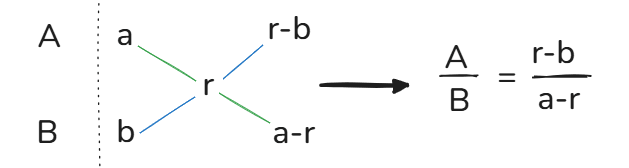
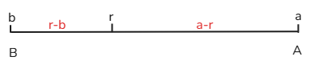
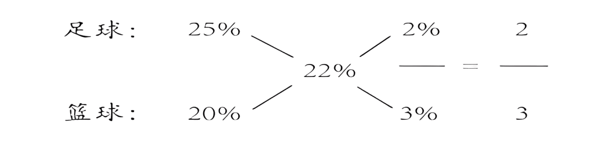
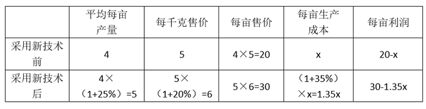

# 十字交叉

十字交叉法实际上是一种方程计算过程中的简化形式。主要用来解决两者之间的比值混合问题，在行测中资料分析以及数量关系都会涉及到。

## 一、十字交叉法

1.  **1、方法来源**：十字交叉法最先是从溶液混合问题（两个部分混合成一个整体）衍生而来的。若有两种溶液（`溶液=溶质+溶剂，如盐水中的水是溶剂，盐是溶质`）的质量分别为 A 与 B ，其浓度（`浓度=溶质溶液%`）分别为 a 与 b（a>b），混合后浓度为 r，则由溶质质量不变可列出下式 Aa+Bb=(A+B)r，对上式进行变形可得r−ba−r\=AB（`分母之比`），在解题过程中一般将此式转换成如下形式：

2.  

    1.  口诀：整体写中间，部分写左边（大的在上，小的在下），交叉做差，得到分母之比。

2.  **2、混合后的原则**：
    1.  （1）居中：混合之后的溶液浓度一定是在原来两杯溶液浓度之间；
    2.  （2）偏大：混合之后的溶液浓度一定偏向原来溶液质量更大那杯的浓度。
    3.  例如：溶液A质量100g，浓度10%；溶液B质量1kg，浓度20%，混合后的浓度r偏向溶液B，即r＞(20%+10%)/2：r＞15%。

拓展：为什么资料分析中求混合增长率用现期？

1.  增长率=增长量÷基期，假设A与B混合后的增长率为r，因为增长量不变，基期A×a＋基期B×b=(基期A+基期B)×r，整理后可得：r−ba−r\=基期A基期B，实际这里的比值是基期的比值。
2.  如果用基期量计算是精确的，但在资料分析中如果用基期量计算就失去了速算的意义，所以用现期量替代基期量来估算，即r−ba−r\=现期A现期B

## 二、题型特征

### （1）混合

1.  **1、满足条件**：两个部分混合成整体。

2.  **2、例如**：全年=上半年+下半年；1-7月=1-6月+7月；进出口额=进口额+出口额；全国=城镇+乡村；总体=A+非A；房地产=房产+地产；全部=男人+女人；研究生=博士+硕士；A类和B类；

### （2）比值

1.  看到了符合以下的公式且存在混合的题目一般都能够运用十字交叉法。
    1.  浓度（%）=溶质溶液
    2.  利润率（%）=利润成本
    3.  折扣（%）=售价原价
    4.  比重（%）=部分整体
    5.  增长率（%）=增长量基期量
    6.  平均数=总数人数
    7.  `比如`：A班女生的比重为45%，B班女生的比重为60%，AB班女生的比重为55%。AB班女生=A班女生+B班女生，存在混合，并且比重=女生÷全班人数；可列式 B班女生：A班女生=（55%-45%）：（60%-55%）=2：1。

## 三、线段法

> 线段法是十字交叉法的变形，只是换了一种画法而已

1.  若有两种溶液的质量分别为 A 与B ，其浓度分别为 a 与 b，混合后浓度为 r，

2.  

3.  **口诀**：

    1.  （1）部分写两边，整体写中间。
    2.  （2）距离和量成反比。（距离是指混合后的的距离的两端差）
    3.  上面的图根据口诀可得：AB\=r−ba−r

## 四、随笔练习

**例1**：（2014四川）学校体育部采购一批足球和篮球，足球和篮球的定价分别为每个 80 元和 100 元。由 于购买数量较多，商店分别给予足球 25%、篮球 20% 的折扣，结果共少付了 22%。问购买的足球和篮球的数量之比是多少？（ ）

1.  A.4：5
2.  B.5：6
3.  C.6：5
4.  D.5：4

解析

6.  方法一：总折扣=折扣后总额/折扣前总额，足球部分少付了25%，篮球部分少付了20%，混合后少付了22%，典型 A，B 的混合题型，因此采用十字交叉法如下：
    
    即足球价格总额与篮球价格总额之比为 2：3。注意该比例是**足球折扣前总额和篮球折扣前总额的比**，设足球共买了 x 个，篮球共买了 y 个，则可列式为 80x：100y=2：3，解得 x：y=5：6。故本题选 B
7.  方法二：设足球共买了 a 个，篮球共买了 b 个，根据混合列式有25%×80a+20%×100b=（80a+100b）×22%，化简得60a+80b=62.4a+78b，因此a:b=5:6

**例2**：（2016联考）某高校艺术学院分音乐系和美术系两个系别，已知学院男生人数占人数的 30％，且音乐系男女生人数之比为 1：3，美术系男女生人数之比为 2：3，问音乐系和美术系的总人数之比为多少？

1.  A.5：2
2.  B.5：1
3.  C.3：1
4.  D.2：1

解析

5.  解法一：
6.  音乐系男生人数占比=音乐系男生÷音乐系总人数，美术系男生人数占比=美术系男生÷美术系总人数；
7.  因为音乐系男女人数之比为 1：3，可得音乐系男生人数占比为1/(1+3)=25%；
8.  因为美术系男女人数之比为 2：3 可得美术系男生人数占比2/(2+3)=40%;
9.  学院男生人数占人数的 30％，即混合后男生人数占人数的 30%，混合题型可采用十字交叉法：

11.  则音乐系和美术系总人数之比为2∶1。，故本题选 D
12.  解法二：
13.  据题目中比例关系，设音乐系人数共有4x人（男生x，女生3x），美术系有5y人（男生2y，女生3y）。根据男生人数占总人数的30%，可得x+2y4x+5y\=30%，解得x＝2.5y。
14.  第三步，音乐系总人数∶美术系总人数＝4x∶5y＝（4×2.5y）∶5y＝2∶1。因此，选择D选项。

**例3**：（2020江苏）某企业预计今年营业收入增长15%，营业支出增长10%，营业利润增加600万元。已知该企业去年的营业利润为1000万元，则其今年的预计营业支出是

1.  A.9000万元
2.  B.9900万元
3.  C.10800万元
4.  D.11500万元

解析

6.  方法一：
    1.  识别：增长率=增长量/基期，收入=支出 + 利润
    2.  根据题意可知收入增长15%，营业支出增长10%，去年的营业利润为1000万元，今年增加600万元，所以营业利润增长了600/1000=60%。
    3.  根据十字交叉法有 15%−10%60%−15%\=5%45%\=去年利润去年支出\=19
    4.  因为去年利润为1000万，所以去年支出为 9000万，今年的支出为: 900×（1+10%）=9900。
    5.  故本题选 B
7.  方法二：
    1.  设去年收入为x万元，则今年预计收入为(1+15%)r=1.15x万元；
    2.  设去年支出为y万元，则今年预计支出为(1+10%)y=1.1y万元。
    3.  去年营业利润为1000万元，则有x-y=1000…①。
    4.  今年营业利润增加600万元，则今年利润为1000+600=1600万元，则有1.15x-1.1y=1600…②。
    5.  联立方程，解得x=10000，y=9000，则今年的支出为1.1y=1.1x9000=9900万元。
    6.  故本题选 B

**例4**：（2019江苏）某银行为一家小微企业提供了年利率分别为6％、7％的甲、乙两种贷款，期限均为一年。若两种货款的合计数额为400万元，企业需付利息总额为25万元，则乙种贷款的数额是：

1.  A.100万元
2.  B.120万元
3.  C.130万元
4.  D.150万元

解析

6.  甲乙年利率分别为6％、7％，两种货款的合计数额为400万元，企业需付利息总额为25万元，则两种合计年利率为25400\=6.25%，使用十字交叉，甲：乙=（7%-6.25%）:（6.25%-6%）=3：1 ，总共400万，乙占一份，则乙为100万元，所以答案为A

**例5**：（2016北京）将1千克浓度为X的酒精，与2千克浓度为20%的酒精混合后，浓度变为0.6X。则X的值为？

1.  A.50%
2.  B.48%
3.  C.45%
4.  D.40%

解析

3.  典型的溶液混合。
    ![](data:image/png;base64,iVBORw0KGgoAAAANSUhEUgAAAaIAAACOCAMAAABEzPykAAAAUVBMVEX//////6pVAAAAAAArgNRVAFWq///UgCsAVaoAAFX/qlUAK4DU/////9SAKwD/1IArAAArACuA1P9Vqv8AACuqVQArAFXU/9RVqtRVACtVVSv1mAeZAAAEsElEQVR42u2dCXKjMBBFcfAMNl4nhNnuf9DRipFjTzCoJbn8XlUWEhWG/9WScKLuqgIAAAAAAAAAAAAAAAAAAAAAAAAAAEjB6q2u67U/+PY99/WAptmYz7Vha01xR471ovM/CW1wo/poc93k0n99Y/V1t6+qw1FSotN5dCmnH+/BJUWOoqbu9H1ulp8pPu3Hu9LCK91vb915v9amrC+NtV76h43kLTW7fZ/Moqrf7Q/HIh2yl9XokFC02/s3PtyDatyq9urj9FN4Qrhp0eE4DHPbeK+/els3EU8XkdNZBbiJDiOJi6ZbYa8sGhq36jft7pfoMGde03SJq8nncOz8xcfsIqfzx/vyswhgO6froqu330c7yXwOez++mcZ2oPOxJ8edKHoti2z82PBQFqmjw1Ep/ynsT2c9tg2N1XJho0TrhZdUCQc6tfKR73KzcKrb+7fLBuOX7VNaDdOgMbEVNLb3tPoj2fXuRZEOpMhzYbnLhWAuWr11VWDRIErdfWqsF1zdZfoS4d6KTnujlyzxlpS9vqnTuUSP7JONC3F7oMUIw94vxceNdfhks8g8BRiLXuHR1T7qdHb91tbumyDsbXCNGzuVlFlXjyuRuW2R7ezGItEOUgx6Tdv5ByT1QK+f6MOw1z+s7aTkGvtQ6t1RAgaL7LTo3vIo80kGAAx17guAL6mzmkQPmUQ+k/J2j6cij1IY9AgZ1MKgR0ktGAY9TtJeTQjNI5luGDSfNNJh0BIS9G9CaCnCCmJQDARFxKBIiAmJQfEQMYkQikt0OTEoOnElxSARIqqKQULE6vqEkCAxxMUgYZbqi0HyLNMYg5Iw3yRCKBnzlMaglMxRG4MS86jghFB6HtIcg/IwWXcMysc06TEoPxNSWEBWpqSwgJxMT2EBmZiewgIyMTmFBeRiagoLyMb/U1hAAUxKYQE5mZTCArIyIYUFZObrFBYAsBTeSS0f/h7xBGDSE4BJTwAm5eBB0TEpOY8rjklJmSc3JqWDfxwunSU641ECFkYCgSTOcoUxSZYo8mKSHNG0xSQhYuqKSRJEFhWTohNfUUyKioycmBQPMSkxKRKSOuJRBEjwWDqkSb1NORXGk8j3DCYNlhRWYZyc3QND0WyDdPnqyZD5/ore/796KRYlFu0JTLphkUzh3WIp3SS9jypRhfHLasTvzG/tPsiDeCH1LyjaJFM0230rXWF8mPr8znxbRj1icd/51NcZHZQIZYwgvjqoJs1AN2wFanZ7XTY2co3s+YQZHbQ0JVjki2ZbpCuMW5RFw27IVm/j2v3KPcy5ex5ndNBq/C3BojD5h3CFcXdeN76Zl7MDXRlbIMOMDmZrplInd0aHS9Fse5EJKoybqe+yM18N/xv1sn2WB+SrKxtndDDBbtIEZN6iOSqafblI9xuZCuN26gt25tudxLrgfV6CjA6ViSBtUVkZHcQrjPupLxhTlD99V0Ct+aDfmANrzWulC/BT33hnvg6fIiwa95thRbt5MYsuU5/fmV9Za5RZV28+ZSDI6GAwUfRaGR1GU5/bme8l6eu6W3jy5QQZHcy1FbBcgIAgo0NlLSKjAwAAAAAAAAAAAAAAAAAAAAAAwPPzD9HWPPtnLRASAAAAAElFTkSuQmCC)
    得到0.6X−0.20.4X\=12。解得X=50%，选A

**例6**：（2017黑龙江）甲乙两队举行智力抢答比赛，两队平均得分为92分，其中甲队平均得分为88分，乙队平均得分为94分，则甲乙两队人数之和可能是:

1.  A.20
2.  B.21
3.  C.23
4.  D.25

解析

3.  平均数问题，甲队平均分=甲队总分甲队人数，乙队平均分=乙队总分乙队人数，混合后两队平均分=两队总分两队人数，因此采用十字交叉法，可得甲乙两队人数比=（94-92）：（92-88）= 2：4 = 1：2，那么甲：乙=1：2，则甲乙总人数为3的倍数，选B。

**例7**：（2021浙江）由于采用了新的种植技术，某种农产品的产量和品质都得到了提升。在平均每亩增产25%的同时，每千克售价也增加了20%。尽管每亩生产成本增加了35%，但每亩利润也增加了100%。问采用新种植技术后，每亩利润占每亩销售收入的比例在以下哪个范围内？

1.  A.不到25%
2.  B.25%~35%
3.  C.35%~45%
4.  D.超过45%

解析

4.  方法一：
    1.  识别：增长率=增长量/基期，成本+利润=售价，每亩售价=每亩产量×每千克售价。
    2.  题干可知平均每亩增产25%，每千克售价增加了20%，因为每亩售价=每亩产量×每千克售价，那么根据乘积增长率公式可得每亩售价增加了25%+20%+20%×25%=50%。
    3.  成本+利润=售价，给的量都是比值，售价作为总量，利用十字交叉可得
    4.  100%−50%50%−35%\=50%15%\=原来的成本原来的利润\=103
    5.  设原来的利润为3元，则原来的成本为10元
    6.  根据生产成本增加了35%，每亩利润也增加了100%可得：现在的利润=3×（1+100%）=6元，现在的成本=10+（1+35%）=13.5，现在的售价为13.5+6=19.5元
    7.  每亩利润占每亩销售收入的比例 = 6/19.5≈6/20=30%
    8.  故正确答案为B。
5.  方法二：
    1.  赋值该农产品在采用新的种植技术前的平均每亩产量为4，每千克售价为5，假设该农产品原来每亩的生产成本为x，则根据题意并结合公式：利润=售价-成本，可得下表：
    2.  

    3.  则可知（20-x）×（1+100%）=30-1.35x，解得r=20013。
    4.  采用新种植技术后，每亩利润=30-1.35x=20013。每亩利润占每亩销售收入的比例=20013÷30≈30.77%，故正确答案为B。

**例8**：（2022四川30%）某网店同时针对A、B两种商品开展促销活动，A商品只按组销售，每组的价格保持10元不变，但每组商品由4件增加到5件；B商品的优惠活动则为买一送一。张某以55元的价格购买了原价总计80元的A、B商品各若干件，其中A商品的件数为B商品的2倍。问B商品原价为多少元/件？

1.  A.1.5
2.  B.2
3.  C.2.5
4.  D.3

解析

4.  方法一：
    1.  识别：折扣=售价/原价，并且A.B 混合买。
    2.  A商品由4件增加到5件：每件原价=10÷4=2.5，每件售价10÷5=2，折扣为2÷2.5=80%。
    3.  B商品：买一送一，相对于打了5折，折扣为50%。
    4.  A.B混合后原价80，售价55，折扣为55÷80=68.75%。
    5.  用十字交叉法：

    7.  注意 5：3表示A原价：B原价
    8.  A和B原价共买了80元，所以A买了50元，B买30元。
    9.  A的数量=总价÷单价=50÷2.5=20件
    10.  其中A商品的件数为B商品的2倍，B商品的数量=20÷2=10件
    11.  B的原单价=30÷10=3元/件。故正确答案为D。
5.  方法二：
    1.  设B商品原价为m元/件，B商品购买了n件，则A商品购买了2n件。根据题意可列方程：
    2.  2n4×10+n×m=80....①
    3.  2n5×10+n2×m=55....①
    4.  联立①②，解得x=3，n=10，即B商品原价为3元/件。
    5.  故正确答案为D。
